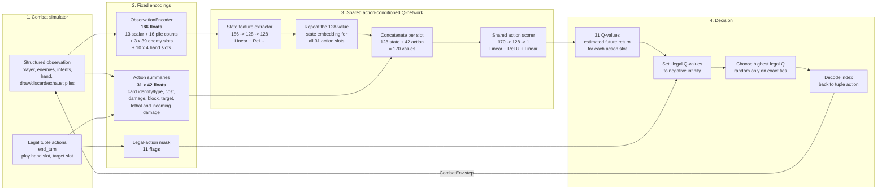
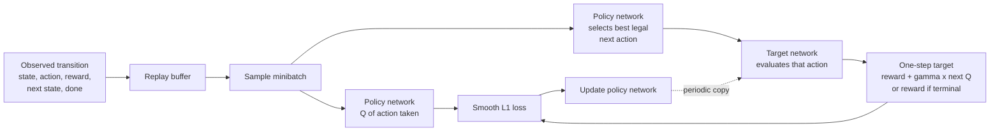

# Double DQN Agent Flow

This sketch shows the current `action_feature` Double DQN path used by the
Overgrowth environment and the saved `double_dqn` checkpoint. It follows one
decision from the readable simulator state to the selected combat action.



## What the two network inputs mean

The network does not receive Python card or enemy objects directly. It receives
two numeric views of the current decision:

1. **One state vector** describes the combat as a whole.
2. **One action-feature vector per discrete action slot** describes what each
   possible action would do in that state.

The state vector is shared between all actions. The same action-scoring network
is then applied to every `state + action` pair. Consequently, a Strike in hand
slot 0 and a Strike in hand slot 4 can share what the network learned about
Strike semantics instead of requiring unrelated output heads.

### State vector: 186 values

| Section | Width | Examples |
| --- | ---: | --- |
| Player/combat scalars | 13 | HP, block, energy, strength, statuses, pile sizes, turn |
| Per-pile card counts | 16 | Four card names across hand, draw, discard, and exhaust |
| Stable enemy slots | 117 | Three slots x 39 features: HP, block, intent, behavior, statuses, identity |
| Hand slots | 40 | Ten slots x four card-identity flags |
| **Total** | **186** | |

Dead enemies remain in their original slots with `alive = 0`, so target and
enemy-slot meanings do not move during combat.

### Action matrix: 31 slots x 42 values

Discrete action index `0` means End Turn. The other 30 slots are the Cartesian
layout of ten hand slots and three enemy target slots:

```text
action_index = 1 + hand_slot * 3 + target_slot
```

Each legal slot receives semantic features such as:

- card identity and kind (`Strike`, `Defend`, `Bash`, or `Slimed`)
- energy cost and energy remaining after play
- whether the card exhausts or has no immediate tactical effect
- projected damage, block, and status application
- target HP, block, intent, identity, and slot
- whether the action kills its target or wins combat
- projected incoming HP loss before and after the action

Illegal action rows are zero-filled, but the legal-action mask is still the
authority: their final Q-values are replaced with negative infinity before
selection. Non-targeted cards such as Defend and Slimed have one canonical legal
slot rather than one duplicate per living enemy.

## What the output means

The network produces one scalar Q-value for every action slot:

```text
Q(state, action) = estimated discounted return after choosing that action
```

These are learned estimates, not damage scores or probabilities. A higher value
means the network expects a better eventual combination of victory reward and
HP preservation. This is why inspecting the Q-value gap between Strike and
Slimed is useful: the gap exposes the network's learned preference before any
action is executed.

## Training path

The policy and target networks have the same shape but different roles during a
Double DQN update:



Only the action that was actually taken receives a direct TD update. Other legal
actions in the same state are scored for selection, but they do not receive a
counterfactual label saying what would have happened if they had been chosen.
The brute-force oracle comparison fills that diagnostic gap by evaluating those
alternative continuations explicitly.

## Source map

- Structured observations and legal actions: [`game/simulation/core.py`](../game/simulation/core.py)
- State and discrete-action encoding: [`game/simulation/encoding.py`](../game/simulation/encoding.py)
- Semantic action summaries: [`game/simulation/action_features.py`](../game/simulation/action_features.py)
- Double DQN network, selection, and updates: [`game/agents/dqn.py`](../game/agents/dqn.py)
- Seeded optimal-policy comparison: [`game/analysis/bruteforce.py`](../game/analysis/bruteforce.py)
