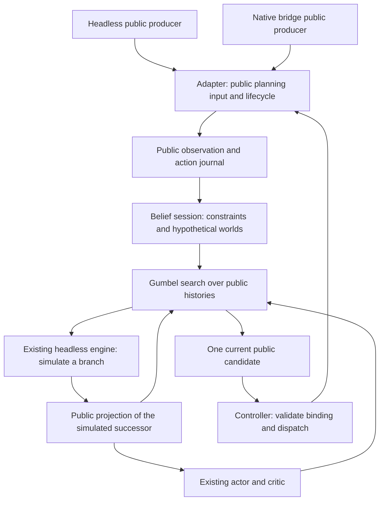

# Combat search architecture redesign

**Implementation plan — 2026-10-04.** The controlled state proof, bounded
belief/search integration, representative Act 1 coverage and a direct conditional
sampling slice and learner input compatibility are implemented. Fresh authored
combat confirmation supports short rollout-assisted search; an incremental
learning gain, campaign benefit and native support remain open gates. The
[training guide](AGENT_TRAINING.md#experimental-combat-search) describes the
existing CLI search prototype. This redesign replaces card-by-card reconstruction
expansion as the recommended direction.

## Recommendation and first acceptance case

Keep the existing headless engine, Gumbel search and learning pipeline. Replace
the restricted reconstruction layer with **engine-owned state construction and
an agent-owned belief session**. A belief is a set of possible game states
consistent with what the player has observed. Its states are hypothetical engine
instances, never copies of the actual game's private state.

Construct these states at a supported public boundary, advance them through the
same actions the player takes, and condition them on the next public observation.
The engine carries generated cards, temporary modifiers, counters and pending
effects forward. Search samples branches from this maintained belief. It should
not repeatedly recreate those mechanics from display values.

The first implementation milestone is a controlled Vantom fight with:

- Infernal Blade generating a card through the existing engine rule;
- the generated card's temporary free-cost effect expiring correctly;
- a publicly known Nunchaku counter advancing and triggering through normal rules;
- a second existing content source using the same state mechanisms, without a
  card-name branch in search or belief code.

Exercise the generated card both immediately and after a turn/reshuffle. Compare
public successors and eventual cleanup with normal engine execution. Tiny
controlled generation pools may establish exact probability checks; they must
be labelled synthetic and followed by a production-catalog case. This is the
smallest useful proof that the redesign reduces duplication.

Initial scope remains Ironclad A0 combat, followed by both Act 1 regions. Native
bridge compatibility is designed now and delivered after the headless proof.
Learned dynamics, campaign search, tree reuse and other characters are later work.

### Delivered state proof and belief/search integration (stages 1–3)

The initial input/state audit and controlled engine-state proof are implemented in
[the declared setup contract](../game/agent/contracts/planning.py),
[shared engine construction](../game/headless/run/construction.py) and
[the maintained belief session](../game/agent/search/belief.py).
[Conformance tests](../tests/agent/test_belief.py) exercise Infernal Blade's
generation and free-cost expiry, Nunchaku's counter/energy trigger, Blood Vial's
single setup trigger, and Jack of All Trades as a second generation source.
Independent small-deck victory and generated-card defeat cases verify combat
settlement, including Burning Blood healing and persistent counters.

The maintained model is available as `public_belief_v1` in the existing search
policy and controlled Act 1 evaluation/collection commands. It requires an
explicitly declared fresh inventory and revealed encounter. A round-one observation
alone does not authorize inventing that declaration. The controlled scenario
producer supplies its public setup constants; campaign starts, corpus attachments
and native execution do not yet supply a supported anchor. The existing
`reconstruction_v1` model remains the default during migration. A teacher uses one
declared model throughout its run; there is no silent reconstruction-model switch.

| Required fact | Current proof source | Later bridge prerequisite |
| --- | --- | --- |
| Card definitions/upgrades and absence of earlier mutable state | Explicit fresh-card templates in the controlled setup | Public acquisition/setup history or a supported reconstruction; current previews alone cannot establish freshness |
| HP, maximum HP and gold before combat entry effects | Declared setup, then normal engine initialization and comparison with the public opening | Retain public HUD at the correct pre-combat boundary; avoid applying entry effects twice |
| Already-owned relics and persistent counters | Explicit definition/counter pairs, including zero; empty instance data is part of the declaration | Public displayed counters and sufficient history for any other instance state |
| Potion slots | Explicit ordered slot contents | Existing public inventory plus compatible lifecycle support for use/children |
| Revealed encounter | Declared registered Overgrowth/Underdocks encounter, checked against the complete generated public opening | Publicly revealed enemies and supported encounter inference; no hidden map assignment |
| Content identity | Card catalog fingerprint, including synthetic fixture catalogs | Pinned native build/rules agreement as well as encoder/candidate conformance |
| Progress and settlement | Synchronous command reconciliation, public selector successors and an immutable combat result captured at cleanup | Separate accepted, selector-progress and reconciled events as designed below |

The belief retains engine worlds between actions and clones them through the
existing validated snapshots. Branches sample independent future RNG while
retaining already-materialized card order/effects and stream ownership. The
shared simulation world and public action keys were extracted from the existing
search model, preserving that model's interface and rule execution path.

The filter samples parents by their posterior weights and runs the ordinary
engine transition. Complete public matches become equal-weight accepted samples;
their likelihood is **not multiplied a second time**. Draw constraints are enforced
by complete public-prefix replay, including duplicates, visible order, placements,
generation and reshuffles. No card-specific inference or forced pile editing is
used. Tests compare duplicate-card draw/posterior frequencies with an enumerated
tiny fixture and preserve known top placement through unrelated actions/recovery.

On population loss, bounded recovery creates fresh hypothetical openings and
replays every verified boundary from the public anchor. It can recover an order
absent from the old population; it cannot skip a contradictory earlier observation.
If time/proposal/step budgets expire, `belief_budget` disables sampling while the
journal keeps collecting verified progress. A later successful replay can resume
search. Invalid receipts, unsupported boundaries or lost history invalidate the
session until a new anchor. Neither case becomes a fabricated combat loss.

Card choices and potion-generated offers retain their materialized options,
pending parent state and stream aliases across forks. Selector progress is one
reconciled synchronous command, not a claim that the whole parent effect finished.
Stage 4 also permits validated selection pauses during setup, enemy turns and
end-turn cleanup, retaining queued work and captured enemy hits before future
RNG refresh. Native asynchronous lifecycle handling remains stage 6 work.

`SearchPolicy.begin_combat()` accepts only the declaration and public opening.
The existing Gumbel tree samples this belief and uses complete public graph keys.
Belief, tree and simulation RNG owners have separate planner seed domains. The
checkpoint/objective/action-mask checks and policy fallback are unchanged. Public
collection supplements retain the declaration and verified cleanup result for
reanalysis; original behavior, outcomes and truncation labels remain unchanged.

Guided random-operation proposals/importance corrections are available in the
separate `direct_belief_v1` slice below, not this rejection model. Full-prefix rejection can
still exhaust its budget on long or unlikely histories. No standalone
bottom-placement or arbitrary-attachment inference capability is claimed by
these controlled tests. Enemy latent state is generated and filtered through
ordinary setup/actions, never guessed from intent icons alone.

Independent semantic review found no remaining blocker for this declared scope.
The focused verification command is:

```bash
PYTHONPATH=. .venv/bin/python -m pytest -q tests/agent/test_belief.py \
  tests/agent/test_belief_search.py tests/agent/test_search.py tests/agent/test_search_training.py
```

These checks establish a controlled architecture proof, not campaign coverage,
native parity, a win-rate gain or the general five-second latency target. Stages
5–7 remain the implementation sequence; native producer certification remains
part of stage 6.

### Delivered broader headless coverage (stage 4)

The shared constructor now derives region and room behavior from the existing
Act 1 encounter registries. All 42 registered ordinary encounters pass independent
normal-setup/public-projection/snapshot checks. Eight selected normal, elite and
boss fixtures across both regions exercise actual Gumbel search and every
advertised root action, including potions and each enemy target. This does not
certify every inventory or generated branch in all 42 encounters.

New conformance cases cover initial relic choices, end-turn retention, a reactive
choice between enemy hits, summoned stable slots, Smog expiry, room-sensitive
entry effects, defeat settlement and Fishing Rod's persistent counter/upgrade at
victory. They use existing engine rules, without content-specific reconstruction
branches. The reactive-choice case exposed a shared public-identity bug: repeated
projection renamed unresolved identical draw-pile cards. References now stay
stable until public progress resolves that ambiguity; normal draw reidentification
still prevents tracking indistinguishable private copies.

The [coverage audit](evidence/COMBAT_BELIEF_COVERAGE_2026_10_04.md) records the
dependency review and a frozen-checkpoint development panel on ordinary starter
decks, with work budgets and residual fallbacks. The contract remains
`sts_declared_combat_start_v1`: no private-state fields, native transport or
campaign-anchor inference were added. Campaign, corpus and native starts still
require public provenance beyond the current observation. The next stage is
profiling and learning verification, not default promotion.

### Direct conditional sampling proof (stage 5, performance slice)

`direct_belief_v1` removes ordinary draw-permutation rejection using an
engine-owned [draw knowledge helper](../game/headless/draw_knowledge.py) and a
[public conditional belief](../game/agent/search/direct.py). Its remaining draw
cards form an exchangeable bag between known top/bottom positions. Each search
simulation samples a fresh remaining permutation; observed draws condition this
bag directly. Normal draw, shuffle, placement, card, enemy and cleanup rules
still execute. No real engine or private snapshot is supplied to the planner.

Opening HP is conditioned inside normal monster construction using its sequential
eligible-HP set. Draw likelihoods include physical duplicate multiplicity; known
positions contribute likelihood one or zero. Guided proposals retain their
importance weights, including during bounded prefix recovery. Enemy/composition
outcomes still use normal proposals and public matching. The finite population
is an approximation for those remaining latent variables, not an exact posterior.

The proof uses the existing declared setup and complete public journal. Extra
headless exports are unnecessary for this slice. A future bridge producer can
supply the same inputs, once it establishes their setup and lifecycle provenance;
it need not implement a different draw sampler. Audited exports of further
publicly knowable engine facts remain an option when broader content needs them.

Coverage is deliberately bounded by the input grammar in `direct.py`: eight
development-panel encounters, fresh supported card templates, four relic kinds
and eight potion kinds. Innate/enchantment ordering, random insertion, autoplay,
retention and generated/moved-to-hand effects are excluded. These are capability
guards, not duplicate card-effect implementations. Unsupported inputs return a
named policy fallback; the broader rejection model remains available explicitly.
The bottom-placement primitive has an enumerated engine fixture; no supported
agent-side content source currently introduces a bottom placement.

The versioned `detached_combat_history_cards_v1` planning view removes historical
card-subject links to current physical copies. Legacy display history can retain
such links across unobserved reshuffles, although identical copies cannot be
tracked that way. Both real and hypothetical actor/critic inputs, matching keys,
and the paired greedy baseline use this conservative view. Current candidates
and the full original observation/action journal remain unchanged. Existing
public-protocol observations and older model behavior are preserved.

The first performance slice was evaluation-only. The subsequent learner
compatibility milestone below enables bounded collection and learning. The
[direct-sampling evidence](evidence/COMBAT_DIRECT_SAMPLING_2026_10_04.md) owns the
frozen paired comparison, timings, validation and remaining gates. Campaign,
corpus and native anchors are still deferred; search stays experimental.

### Learner input compatibility (stage 5, learning slice)

One shared public transformation in `game/agent/input_views.py` now supplies the
detached-history view to search and learning. Feature batches, corpus identities
and normalized student checkpoints declare that view. The v4 inference bundle
binds the view and its feature identity; v1–v3 bundles retain raw semantics.
Direct collection and reanalysis write v2 reports/targets with explicit view
provenance. Missing or mismatched views fail before training, and mixed-view
batches cannot enter the model.

A raw teacher can initialize a normalized student with unchanged weights and a
fresh optimizer. Inference applies the saved view even without search. Exact
imitation/PPO resume preserves it; ordinary PPO collectors still collect their
own behavior, including in spawned workers. Search data remains offline
distillation data. Reanalysis copies original public actions and outcomes and
refreshes only policy targets; unfinished episodes receive no terminal labels.

The older `commit_single_card_v1` action restriction depends on the historical
selected-card link, so this view rejects that pairing. The current specialist's
`commit_decisions_v1` uses current combat selector state and remains supported.
This preserves action restrictions without introducing another selector rule.
The [learning evidence](evidence/COMBAT_SEARCH_LEARNING_2026_10_04.md) records
tests and the bounded collection/student/reanalysis experiment. This establishes
pipeline compatibility, not a credible combat-strength gain or promotion.

The existing `search-audit` command now preserves maintained-belief models and
their recorded public anchors. It compares raw critic/search estimates with
completed original outcomes and paired sampled continuations: greedy throughout,
or the search first action followed by greedy play. Original behavior, model
estimates and unfinished simulations remain distinct. A refreshed report keeps
the original trajectory's build/rules identity. Audited positions retain source
fight groups; they are not independent confidence-interval samples.
The [128-start benefit experiment](evidence/COMBAT_SEARCH_BENEFIT_2026_10_04.md)
met the tested latency/coverage requirements but found identical win outcomes
for greedy, root-only and Gumbel. Critic diagnostics found substantial
encounter-specific errors and action-reference changes without return gains.
That starter inventory gave little leverage for a strategic comparison. The
[developed-deck benchmark](evidence/COMBAT_SEARCH_DEVELOPED_BENCHMARK_2026_10_05.md)
now supplies public declared inventories, a reproduced ordering witness, and
separate challenge/control results. Its 32 harder starts gave Gumbel two rescued
losses and one lost greedy win; this does not establish a reliable improvement.
That panel left stage 5's credible-benefit gate open. The
[decision diagnosis](evidence/COMBAT_SEARCH_DEVELOPED_BENCHMARK_2026_10_05.md#follow-up-decision-diagnosis)
now isolates the outcome-changing actions and a costly deeper-search reversal
against Matriarch. Optional bounded greedy rollouts can now evaluate leaves using
the same hypothetical world and public network inputs. Completed rollouts return
the settled combat reward; unfinished rollouts bootstrap from their final public
critic. Their estimates are backed up for that simulation without changing a
shared node's network value. Critic-only search remains the default.

Developed inventories now support balanced training collection and frozen
evaluation splits. Distillation supports exact dataset passes and disjoint fresh
and reanalysed reports; bounded reanalysis retains the selected original episode
IDs and outcome provenance. The
[October 6 frozen study](evidence/COMBAT_SEARCH_LEARNING_2026_10_06.md) now
demonstrates a rollout-search benefit on fresh authored challenge fights at the
tested thinking cost. A 480-fight, three-seed learning round did not improve
searched wins on confirmation. The useful-search gate is met for this narrow
population; policy transfer and stronger teacher decisions remain learning
questions. The [follow-up strength study](evidence/COMBAT_SEARCH_STRENGTH_2026_10_06.md)
finds a positive fresh combat-return result from expensive planning, which still
misses the thinking-time target. It identifies the balance between priors and
estimated values at the root, plus a cheaper horizon extension, as concrete next
experiments. More passes over those labels do not constitute additional
self-play or reanalysis rounds. Campaign and native anchors still require their
own implementation and validation before broader acceptance.

### Observed Vantom prefix capability

The October 8 Vantom extension adds `revealed_belief_v1` as a separate producer
capability. It retains the architecture below: public facts enter an agent-owned
belief and the existing engine executes each hypothetical state. An ephemeral
engine observer supplies intermediate public draw/autoplay, visible generation
and displayed-cost receipts, avoiding inference solely from the final hand.
Accepted public prefixes support later-turn attachments. The original collector
reproduces saved source starts exactly before those prefixes are admitted;
private source snapshots remain in the evaluator.

Opening and continuation proposals filter one public boundary at a time and
retain accepted parents, rather than repeatedly rejecting whole long prefixes.
Known-end draw constraints survive ordinary shuffles, placements and sampled
random insertions. Generated cards, selectors, retention, relic triggers, cost
layers and cleanup stay in normal rules. Randomized displayed costs condition
on all compatible raw setters, preserving hidden provenance. Recording neither
changes the actual state nor consumes extra gameplay RNG.

Resampling a hypothetical draw pile also refreshes pending selectors' cached
candidate ordering through engine eligibility queries. Membership, selected
order, bounds and sampled whitelists remain unchanged; strict snapshot validation
still checks every fork. Deferred live choices retain their captured membership
until the normal scheduler resumes them.

This extends the verified headless Vantom population, not the general live bridge
producer. The bridge still needs public setup provenance and ordered equivalent
receipts. Finite particles approximate remaining hidden state. Current simulated
tree children retain successor public observations but omit intermediate reveal
journals, which can merge observable histories and limit decision quality.
The [training guide](AGENT_TRAINING.md#public-model-and-current-coverage) describes
the programmatic hooks and preserved learning/provenance checks.

## Why change the current boundary?

The prototype already executes branches with `RunEngine.apply()`. Damage, block,
card effects and enemy turns are not a second search rules engine. The fragile
part is building the state on which those rules operate:

| Current mechanism | Proposed change |
| --- | --- |
| Content allowlists and manual field assignment in [headless planning](../game/headless/planning.py) | Shared engine construction/validation primitives and explicit support for state mechanisms |
| Public state parsed through [training action-preview helpers](../game/agent/training/action_features.py) | A public planning input independent of feature encoders and training |
| Headbutt-specific history inference in [the search model](../game/agent/search/model.py) | Engine transitions plus generic constraints for observed placement, draw and shuffle operations |
| Reconstruct a world from the current display for each simulation | Maintain hypothetical states across real actions; clone/sample them for simulations |
| Headless-only reconciled-transition hook | A common public observation/action lifecycle usable by headless and native controllers |

The [October 4 pilot](evidence/COMBAT_SEARCH_2026_10_04.md#campaign-coverage)
searched zero decisions in four genuine development campaigns: 112 decisions
were forced and 451 fell back on unsupported content. This makes coverage the
immediate obstacle to measuring campaign benefit. It does not establish that
search improves play. The reported blockers are first-failure counts, not a full
dependency audit.

State reuse is not permission to assume missing information. A displayed cost
of zero may have several different expiry conditions. A public enemy intent may
be compatible with several internal phases. Serialization preserves a supplied
state; it cannot establish which unknown state is justified.

## Ownership and data flow



The engine under search is local Python even when the real game is native.
The bridge observes and executes; it does not host the search tree or network.

| Owner | Responsibility | Boundary |
| --- | --- | --- |
| `game/headless/` | Rules, content definitions, runtime state, construction, validation, cloning and random operations | Plain domain data; no agent contracts, bridge, encoding or training imports |
| `game/agent/contracts/` | Versioned public facts, uncertainty and lifecycle records | No private engine fields or transport bindings |
| `game/agent/headless/` | Headless projection and translation to the shared public interface | Explicit public allowlist; no private snapshot export |
| `game/agent/search/` | Public journal, beliefs, semantic action mapping, tree and search results | Receives public inputs and its own random seeds only |
| Existing policy/training modules | Priors, critic, fallback, collection, distillation and reanalysis | Existing checkpoint/objective and behavior provenance checks |
| Existing bridge client and native owners | Native public translation, ownership, dispatch, receipts and cleanup | Opaque native bindings remain controller-private |

Keep the implementation in these existing packages. Split the current search
model into public-input translation, belief maintenance and the simulation
adapter as needed; do not introduce another simulator or bridge service.

## 1. Public planning input and journal

### Preserve the policy contract

Keep `sts_public_decision_v2` and its advertised candidates as the policy-facing
decision. Introduce a separate immutable, versioned planning input containing
that decision, supplemental public facts and public history coverage. Both
adapters assemble this input. Existing policies can continue to accept only the
decision; existing encoders/checkpoints do not automatically acquire new features.

The supplemental record must distinguish:

- observed facts, with the public observation that established them;
- facts derived from public history and pinned game rules;
- unknown values, with supported constraints or an explicitly unavailable prior;
- missing observations, attachment boundaries and invalidated history.

Start with the facts required by the acceptance case, not a universal event
schema. Useful state families include card definition/upgrade/modifications,
public card movements, cost-effect lifetime, visible relic counters, observed
enemy moves, selector source/options and combat settlement. Extend these only
when a concrete mechanism needs them. Ordinary decision snapshots remain enough
where their difference unambiguously establishes the public result.

Use the existing card vocabulary and pinned content catalog. Native card damage
and block are displayed previews, not base `CardSpec` values. Construct base
definitions from the compatible catalog, then reconcile observed modifications
and previews. Do not reverse-engineer base damage from a buffed display or parse
localized description text as the authoritative rule definition.

### Preserve identities without learning hidden associations

Use public references, stable enemy slots and visible card positions for action
matching. Hypothetical worlds may have private object identities for execution,
but those never become tree keys, network features or real dispatch bindings.
Treat indistinguishable hidden copies as exchangeable; preserve any distinctions
that public history actually establishes. Do not equate native object IDs with
headless instance IDs or compact surviving enemies into new public slots.

The journal stores public observations and semantic actions in order. A local
sequence number relates entries; it is not a native token. Record run/combat
boundaries and whether coverage began before setup, at combat opening or at a
late attachment. Empty attachment history does not mean no previous effects.

### Separate public progress from action completion

Normalize controller activity into these cases:

| Event | Belief/journal behavior |
| --- | --- |
| Initial actionable observation | Establish coverage and initialize, or return a named unsupported reason |
| Accepted action, still waiting | Record the pending action; acceptance alone does not certify its effects |
| Verified public successor, including an owned selector | Condition the belief at that public decision boundary; retain any pending parent action |
| Verified action completion | Mark the action settled exactly once; do not apply its effects a second time |
| Confirmed rejection with no mutation | Do not advance the belief; use the existing bounded fresh-observation path |
| Uncertain mutation, lost ownership or failed cleanup | Stop the controller; invalidate pending planning work |

A selector can be a valid next decision while its initiating card or potion is
still unresolved. Requiring the parent to finish before search can see the
selector would deadlock that interaction. Conversely, observing a selector is
not permission to label the parent reconciled. Keep the public decision journal
and the controller's completion ledger distinct.

## 2. Engine-owned construction and state primitives

Refactor reusable domain construction/validation from the existing card and run
snapshot machinery, including [CardState](../game/headless/core/card_state.py),
[card restoration](../game/headless/core/snapshots.py) and
[run restoration](../game/headless/run/snapshots.py). The engine-facing builder
receives a fully specified **hypothetical** domain state assembled by the belief
layer. It does not accept a `PublicDecision` or decide what the player knows.

Construction has two explicit boundaries:

1. **Before combat setup:** when the public setup inputs are available, run the
   existing combat initializer and condition on the observed opening. This
   naturally applies start-of-combat effects once.
2. **An established combat boundary:** use shared state primitives for facts
   already established by the observation/history and supported latent samples.
   Do not run setup effects again. Missing modifier provenance or pending work
   must be recovered by replay from an earlier supported boundary, or rejected.

Start implementation with the first boundary and the minimum opening-state
construction necessary for the proof. General mid-combat construction is not a
prerequisite. A campaign-started fight also needs current persistent inventory
and counter facts; attaching at its opening does not reveal earlier run history.
Wait until the encounter is publicly revealed before conditioning its setup;
never read a hidden map encounter assignment to initialize a belief early.

Reuse runtime components for generated-card identity, modifier lifetime,
relic/power state, enemy state and suspended task/selector state. Mutable state
must have explicit ownership and serialization. Avoid a new parallel copy of
every `CardState` field in the agent; translate supported public facts into the
engine's shared primitives.

**Content extension rule:** a new card composing supported operations and state
components should work without a search registration. A genuinely new state or
information mechanism may require an engine state component, public visibility
mapping and/or belief update. Put rule behavior in its existing engine owner.
Do not replace `search_card_X` with an equally bespoke `restore_card_X` registry.

Check support by required state mechanisms, observable prerequisites and engine
capabilities. Retain explicit exclusions while a mechanism is unvalidated. This
is not permission to remove the prototype's allowlists all at once. Include
dependencies created by generation, consumed items and earlier effects. An
unsupported legal branch must not disappear from the action set or quietly gain
an optimistic value; the initial redesign falls back for that decision and
does not publish an improved training target.

All branches use `RunEngine.apply()`, including potion-owned choices and combat
completion. Construct enough run context to preserve cleanup healing, persistent
inventory changes and the relevant room continuation. Never assume every fight
is an ordinary combat room. An unsupported event/room continuation is a named
fallback. Stop the combat objective after its correct settlement; unopened
rewards and future map content remain unavailable to the policy.

Private snapshot formats retain their current strict meaning. A snapshot of an
already hypothetical world may be used for cloning. An actual engine snapshot,
even with a shuffled draw pile or removed RNG fields, is never a planner input.

## 3. Belief maintenance without another rules implementation

Use a hybrid representation: **exact public constraints plus a bounded weighted
population of hypothetical engine states**. The particles carry state that the
engine has already evolved; constraints prevent needless guessing of facts such
as a publicly placed top card. This adapts the simulation/history idea in
[POMCP](https://proceedings.neurips.cc/paper/2010/file/edfbe1afcf9246bb0d40eb4d8027d90f-Paper.pdf).
Our Gumbel planner and approximate filtering do not inherit that paper's formal
guarantees.

### Initialize

1. Validate game/content compatibility, history coverage and required facts.
2. Build known engine state from those facts and normal setup rules.
3. Sample jointly consistent unknowns: unconstrained draw order, supported enemy
   latent state and other unknowns with a justified prior.
4. Project each world through the same public semantics and condition on the
   observed opening, including its legal candidates and visible intent.

Do not treat every conceivable enemy phase as uniformly likely. Use the engine's
move probabilities and observed move history. If no supported prior or sufficient
history exists, fall back instead of filling internal fields with zero/defaults.

### Update after public progress

Advance hypothetical worlds with the observed action using the real engine,
then condition on the next verified public observation. A generated card, relic
trigger or expiring modifier is carried by that execution. Belief code should
not repeat the effect's arithmetic or timing.

Naively waiting for a sampled world to draw an entire observed hand can be very
expensive. Add conditioning at reusable random operations where necessary:
draw/permutation, categorical generation, random target and enemy move choice.
The engine owns each operation's candidates and probabilities; the belief layer
conditions on public evidence. If an engine random-operation hook is needed,
keep it optional, local to hypothetical execution and independent of agent types.
Normal engine execution must retain its existing RNG behavior.

For these conditional proposals, retain the observation likelihood/importance
weight. Matching an observation does not make all matching worlds equally likely.
Check duplicate-card multiplicities and joint correlations with small enumerated
fixtures. Preserve known top/bottom placements until a rule consumes or changes
them; a shuffle invalidates only the constraints that its actual operation
destroys. Within one simulated trajectory, retain its sampled order. Between
independent simulations or guided filtering proposals, resample only the
exchangeable unknown part permitted by the maintained constraints.

Resample/replenish under a bounded budget. On population collapse, first rebuild
from the latest supported public anchor and replay its public prefix. Rebuilds
must not inspect actual hidden state or resample unconstrained fields to overwrite
contradictory evidence. If no valid population can be obtained within budget,
report `belief_inconsistent`, `missing_history`, `unsupported_state` or
`belief_budget`, and use the existing policy for an otherwise valid decision.
Transport uncertainty still stops play; it is not a policy fallback case.

Continue recording public progress during fallback. Resume search only after a
successful reconstruction/replay or a new supported anchor. Bound journal and
particle memory; retain public anchors and replayable prefixes, or explicitly
mark coverage lost. Do not grow an unbounded full-run world tree.

### Sample for search

For each simulation, sample a world by its posterior weight and clone it. Keep
the belief population separate from the search tree and rebuild the tree after
each real action initially.

Planner RNG is independent of actual gameplay RNG. Separate belief sampling,
tree exploration and hypothetical future-chance streams. Preserve engine stream
aliasing and already materialized outcomes such as a sampled deck order or
pending choice. Fresh simulations need fresh future chance, not repeated replay
of one particle's accidental future RNG sequence. Fork those future streams only
at supported boundaries; do not redraw an outcome already committed in state.

Only public simulated observations reach the network and tree. The observation
function must not expose a latent modifier/identity merely because the sampled
engine knows it. The adapter's public capabilities also apply to simulated
observations. Choices share statistics by observable action/observation history;
the planner cannot choose a different action solely because two particles have
different hidden draw orders. Newly revealed outcomes may create different
observable branches, which may then choose differently.

## 4. Search and learning compatibility

Keep Gumbel root selection, sequential halving, completed-value policy targets
and the existing non-root rule. Retain 16 simulations for collection, 64 for play
and 256 for research, with fixed-budget evaluation and configurable depth/time
limits. Enemy behavior remains chance, with no alternating value sign.

The simulation adapter continues to provide legal semantic actions, a public
successor and the declared combat reward. Reconcile every selected root action
to exactly one advertised candidate under the checkpoint's existing restrictions.
Do not silently narrow the real legal action set to hide model incompatibility.
Forced actions and invalid search results return the same checkpoint policy.

The actor/critic objective remains unshaped combat victory plus 0.1 times winning
HP fraction after cleanup, with defeat zero and compatible discounting. Preserve
checkpoint, encoding, action-mask and objective checks. Improving reconstruction
does not make an Act 1 critic interchangeable with this combat critic.

Version the planning input, belief model and search identity separately from the
existing observation/checkpoint schemas. Collection records the public prefix or
anchor, candidate mapping, search distribution, teacher/configuration identity,
planning seed, support/fallback and budget diagnostics. Existing v2 checkpoints
remain usable if their original representation/action/objective checks pass.
Adding new network features would be a separate encoder/checkpoint change.

Old public trajectories can be reanalysed only when their retained observations
and history supply the required facts. Missing facts are explicit unsupported
records, not values recovered from paired private continuation snapshots. Keep
original behavior/outcome provenance, preserve unfinished episodes as truncated,
and collect new completed fights for fresh value labels when needed. Hypothetical
particle state is not public training input.

Search distillation still trains the actor against a legal probability target
and the critic against completed behavior returns. Keep searched trajectories
out of on-policy PPO. Freeze each collection teacher and evaluate students before
promotion. Reanalysis remains useful without a learned simulator; see
[Reanalyse](https://arxiv.org/abs/2104.06294). Learned dynamics are deferred while
the existing engine and measured bottlenecks favor this approach.

## 5. Native bridge compatibility

### Reuse the current bridge and shared policy boundary

The existing [`agent_v2` producer](AGENT_CONTRACT.md#native-full-run-v2-candidate)
already exposes the rich public graph and semantic candidates.
[`agent_host.py`](../bridge/Sts2AgentBridge/apps/bridge/client/agent_host.py)
keeps native bindings outside its policy callback. Extend that client with the
same planning session lifecycle used by headless execution. Keep the one
production bridge, router, native owners, transport and package workflow.

The current callback alone is insufficient: it receives a decision, while
native acceptance/reconciliation proceeds asynchronously. Its optional live
recorder also does not claim headless transition equivalence. Add explicit
session hooks; do not infer full effect completion from a policy call or from
an aggregate counter increase.

The compatibility audit must settle these concrete requirements before native
search is enabled:

| Needed by planning | Native integration decision |
| --- | --- |
| Card definitions, upgrades and current visible modifications | Translate public vocabulary against the pinned engine catalog; validate visible previews without confusing them with base stats |
| Card generation and temporary effects | Retain the observed triggering action and public successor; let hypothetical engine execution establish candidate histories |
| Relic/power counters and duration | Use genuinely displayed facts or derivable public history; unknown is not zero |
| Draw contents and placements | Preserve canonical unordered contents plus publicly established positional constraints; never export internal draw order |
| Played-power and earlier-action history | Attach before combat setup when required; late attachment cannot import private native history |
| Selector progress and parent completion | Correlate owned public decision boundaries and verified receipts in the existing controller; preserve pending parents |
| Combat victory and cleanup HP | Supply a verified public combat settlement equivalent in meaning to the headless combat summary; do not substitute full-run victory |
| Checkpoint features and action mapping | Prove that the selected encoder accepts native public inputs with the same meaning as its training inputs; a shared graph schema alone is insufficient |
| Native/engine version and supported content | Validate the pinned build/catalog and mechanism capabilities; incompatible search falls back only if ordinary dispatch remains valid |

If existing observations suffice, build the planning supplement in the client.
If a necessary fact is public but absent, extend the existing producer/routes
with explicitly negotiated, versioned semantics and strict decoder tests.
Preserve the current wire behavior for clients not using that extension. Do not
silently add fields to a strict v2 record or expose private fields under a new
name. Protocol compatibility does not make unavailable information observable.
Resolve the exact extension shape from this small field audit before coding it.

Run encoder/candidate conformance fixtures before loading a checkpoint for native
play. If it requires unavailable features, select an already compatible fallback
controller or stop that mode; do not synthesize privileged features to make it
load. Any feature-normalization change needs its own representation compatibility
check and, when semantics change, a new encoder/checkpoint version.

Opaque parent/child receipt matching stays inside the controller. If the current
aggregate counts cannot establish which action produced a public boundary, add
the minimum private coordination evidence to the existing protocol/owner, or
mark the sequence unsupported. Only the validated semantic result reaches the
planning journal. A fixture must exercise a potion/card selector while its
parent remains pending and verify both completions exactly once.

### Keep planning latency separate from native execution

Run search in the Python client between actionable public observation and POST.
Never run it inside a native game-thread callback. The existing 500 ms bridge
submission/frame-result deadline is not a thinking budget and must not be
increased to accommodate search. Give planning its own cancellable deadline,
also bounded by the remaining controller/episode budget and dispatch reserve.

Keep the original opaque binding in the controller while planning. Immediately
before dispatch, use the existing native freshness/legality validation. A fresh
decision requires a fresh plan or fallback; matching `action:0` is not enough.
A confirmed stale rejection with no mutation uses the existing bounded
re-observation path. An uncertain POST, timeout or cleanup failure stops the
host without retry. Discard delayed search results after any binding/session
change, disconnect, manual intervention or terminal outcome.

Retain attempted, accepted, reconciled and pending counts, existing ownership,
controller limits and cleanup. Do not poll a waiting animation as though it were
a new decision, or advance hypothetical state twice when its parent settles.
No action is dispatched because a hypothetical engine predicts it will be legal.

Live histories needed during a session can remain in memory. Durable live
trajectory retention is a separate opt-in under the
[existing live-data rules](../bridge/Sts2AgentBridge/README.md#client-modes).
This plan does not authorize profile/save/history/Cloud access, retained live
data collection or a native launch. Later native validation follows the
[live development guide](LIVE_DEVELOPMENT.md) within its actual task scope.

## 6. Implementation sequence and exit gates

Complete these stages in order. Native compatibility shapes the early contracts;
native execution does not block the initial headless proof.

| Stage | Deliverable | Exit gate |
| --- | --- | --- |
| 1. Input and state audit | Map the first acceptance case's required facts to current headless/native producers and shared engine state. Specify the minimal planning input, lifecycle and construction boundary. | Every required value is public/derived, a supported latent sample, or an explicit missing prerequisite; no private-state dependency |
| 2. Engine state proof | Shared construction/validation plus a small persistent belief prototype for generation, temporary cost and a relic counter | The acceptance case matches normal transitions; another source composes these mechanisms without search content branches; branch isolation holds |
| 3. Belief and search integration | Weighted conditioning, public journal, generic draw constraints, selector replay and the existing simulation interface | Hidden-state invariance, enumerated chance fixtures, duplicate/placement/reshuffle cases, pending selectors and bounded collapse recovery pass |
| 4. Broader headless coverage | Audit all dependencies in representative development fights, then add missing state mechanisms across both Act 1 regions | The selected panel actually exercises search; coverage and remaining reasons are reported, including failures masked by earlier blockers |
| 5. Performance and learning verification | Profile the new model; paired policy/root-baseline/tree comparison; collection, student and reanalysis checks | Measured latency/throughput, credible combat benefit before scaling training, correct probability/outcome provenance and no PPO contamination |
| 6. Bridge adapter and native proof | Shared lifecycle integration, minimal public-field/protocol extension only where justified, offline native/headless conformance fixtures, then a bounded live combat case | Correct public state, one chosen advertised action, stale/selector handling, verified combat settlement and cleanup; separate synthetic/released/live evidence |
| 7. Campaign evaluation | Freeze checkpoint/search/belief configuration and compare the same hybrid controller with/without combat search | A positive paired Act 1 difference with a 95% confidence interval excluding zero before default promotion; otherwise remain experimental |

Keep the current restricted implementation usable during migration, with an
explicit model-version choice for comparisons. Once stages 2–3 establish parity
on its supported cases, replace its reconstruction internals and remove the
duplicated allowlists/history special cases superseded by tested mechanisms.
Do not keep two permanent search engines or silently mix reconstruction models
within one teacher run. Retain named exclusions still needed by the new model.

Update current usage/support documentation when implementation changes. Preserve
the October 4 evidence and its original artifact identities; it records a
different model and must not be repinned as evidence for this redesign.

## 7. Validation and measurement

### Correctness

- **Information boundary:** identical public histories with different actual
  private draw order, RNG, card identities and enemy state produce identical
  fixed-seed, fixed-work results. Actual game state and RNG remain unchanged.
- **Visibility:** headless and native-shaped fixtures produce equivalent planning
  facts for equivalent public histories, despite different object IDs/display
  representations. A synthetic world cannot reveal more than that input permits.
- **Beliefs:** enumerated small cases verify posterior weights, draw multiplicity,
  known placement, reshuffle, ambiguous enemy phases and generated-card outcomes.
  Missing history, zero-probability observations and population collapse return
  bounded explicit failures rather than invented defaults.
- **State/rules:** normal execution and hypothetical execution agree on supported
  deterministic transitions, effect expiry, counter persistence, cloning,
  selectors, multi-enemy targeting, potion consumption and combat cleanup.
- **Lifecycle:** rejected actions do not advance history; waiting is not a new
  action; selector progress does not falsely reconcile its parent; completion
  does not double-apply effects; stale/disconnected sessions discard old plans.
- **Search/training:** preserve legal root selection, checkpoint restrictions,
  normalized soft targets, separate objectives, teacher identities and truncated
  outcomes. A fallback is not labelled as a searched improvement.

As required by [the working guide](../AGENTS.md#review-and-validation), obtain
one independent semantic review of public-information/RNG changes and relevant
protocol/lifecycle changes before their implementation gate closes. The
prototype's prior review does not cover this redesign. Run focused adversarial
and integration checks; apply the existing release gate when a native package
actually changes. Documentation alone does not require gameplay tests or launch.

### Performance and efficacy

The target remains 1–5 seconds per played action on the local Mac. Measure total
decision latency, including belief update, replenishment, projection and inference,
not only tree traversal. Report fixed-simulation completion separately from
deadline-limited results. Belief particle count and replenishment work are
separate bounded settings, not synonyms for simulation count; choose their
initial limits using the stage-2 proof rather than assuming 64 particles is optimal.

Profile construction, cloning, conditioning, transitions, projection, inference
and memory independently. The existing pilot spent more time in projection and
inference than rule execution; persistent states are a maintainability and
coverage improvement, not a demonstrated speedup. Optimize measured costs before
considering a language rewrite or learned transition model.

Use one planning owner per fight and existing worker processes for independent
fights. Report single-game latency and parallel collection throughput separately.
Record searched/eligible/forced decisions, all diagnosed support gaps, fallback
reasons, belief failures, completed simulations, mean/p95/max time, combat wins,
remaining HP, potion use and Act 1 completion. Distinguish search timeout,
episode cutoff, transport failure and actual defeat.

Tune on training/development data. Compare the same frozen checkpoint as greedy,
root-action simulation baseline and tree search, with identical public inputs
and noncombat decisions. Inspect critic disagreements using completed fights and
bounded policy rollouts. Pair starts and group correlated continuations by source
fight/campaign when computing confidence intervals. Freeze the configuration
before opening held-out tests. Architecture correctness and wider coverage alone
do not establish a stronger agent.

After useful search is demonstrated, prioritize a campaign-aware combat exit
value that accounts for HP, potions and future encounters. Revisit learned
dynamics only if faithful simulation remains a measured bottleneck after targeted
optimization. This redesign does not require changing to MuZero to avoid rule
duplication: the existing engine remains the one executable source of game rules.
