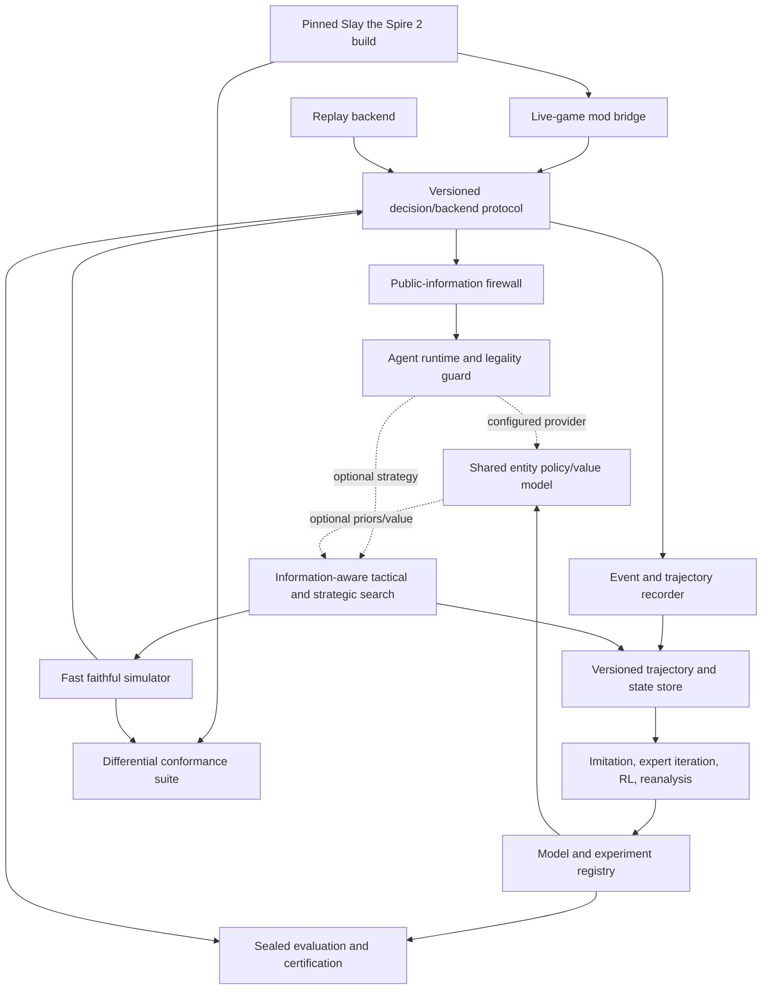

# Long-Term Architecture and Research Roadmap

- **Status:** strategic north-star document
- **Last reviewed:** 2026-08-31
- **Scope:** a functional, single-player Slay the Spire 2 agent that can
  eventually support a defensible near-optimal claim

This document describes the destination and the dependency order for reaching
it. It complements, but does not replace, the short-horizon work in
[`ROADMAP.md`](../ROADMAP.md). The short-term roadmap may continue to evolve as
the current combat research environment improves; this document should change
only when the full-project strategy or end-state architecture changes.

The legacy simulator and research pipelines described here were retired on
2026-09-22 (D69). Their migration plans are superseded by the current engine and
[HF-44–47 adapter assignments](HEADLESS_FULL_GAME_IMPLEMENTATION.md#open-assignments).

This is a specialist design reference, not a mandatory startup checklist.
Its dated descriptions of repository state and proposed increments are historical;
use [current status](STATUS.md) and [ROADMAP.md](../ROADMAP.md)
for present capabilities and priorities. [AGENTS.md](../AGENTS.md) owns the
streamlined development process, including proportionate review and validation.

Program references (read only the relevant one):

- [Current target](TARGET.md) defines the initial scope, information boundary,
  objective and unresolved evaluation requirements; the archived charter retains detail.
- [`PHASE_1_INTEGRATION_SPIKE.md`](archive/phase-1/PHASE_1_INTEGRATION_SPIKE.md) preserves the
  earlier evidence campaign for selecting the live truth path and fast backend.
- [Current status](STATUS.md) records the unified bridge capabilities, evidence
  levels and exclusions.
- [`PHASE_1_ACTOR_READY_EXECUTION_PLAN.md`](archive/phase-1/PHASE_1_ACTOR_READY_EXECUTION_PLAN.md)
  preserves completed bridge/headless packet contracts; it is not the active queue.
- [`MULTI_AGENT_EXECUTION.md`](MULTI_AGENT_EXECUTION.md) defines how parallel
  work is owned, reviewed, integrated, and reported to the user.

It is intentionally not a promise of dates. The simulator-fidelity work and the
quantity of game content make calendar estimates misleading until repeatable
full-game control and conformance milestones have been completed.

## 1. Executive direction

The current repository contains a useful deterministic combat research
laboratory and a bounded `R0i` live-game interface. It is not yet a small
version of the final system: the live path is not a complete autonomous run,
and the combat simulator is not yet a faithful full-game backend. A near-optimal
full-run agent needs several foundations that cannot be obtained by continuing
to widen the current observation vector or fixed combat action grid.

The recommended project is a hybrid of three systems:

1. **An authoritative live-game interface.** A versioned in-game mod bridge
   exposes exactly player-visible state, legal decisions, accepted actions, and
   content/build metadata. It is the source of truth for actual-game evaluation
   and simulator conformance.
2. **A fast, faithful model of the game.** A headless backend provides
   deterministic replay, snapshots, chance outcomes, high-throughput training,
   and search. The existing Python simulator is the starting asset, but its
   expanded rules must be checked continuously against the live game.
3. **A planner-capable policy/value agent.** A shared entity model scores
   variable legal action candidates and predicts eventual run value. Optional
   search can improve difficult decisions using the simulator; the improved
   decisions become new training data.

The central bet is therefore **not** “train a much larger PPO model.” It is:

> Establish a trustworthy model of a pinned game, then combine learned
> generalization with explicit planning and continuously measure the remaining
> decision regret.

The current combat stack remains valuable as a legacy adapter, smoke test,
baseline suite, and first tactical training domain. It should not constrain the
new state, action, content, or model contracts.

## 2. Define the claim before optimizing it

“Near optimal” is not meaningful without a ruleset, information boundary, and
compute budget. The first program milestone must produce a target charter with
the following fields:

| Dimension | Required declaration |
| --- | --- |
| Game | Exact build/depot and assembly/resource hashes, branch, content manifest, bridge binary, and ordered allowed mod list |
| Mode | Single-player first; seeded/unseeded evaluation stated explicitly |
| Scope | First character, unlock assumptions, run modifiers, and target Ascension |
| Information | Exactly the information available to a normal player; whether the displayed run seed is withheld from the policy |
| Objective | Probability of winning the complete run |
| Compute | Per-decision and whole-run wall time/nodes/simulator calls, model size, memory, hardware/batching, precomputation, pause, and timeout rules |
| Reliability | Allowed automation failures, timeouts, invalid actions, retries, and manual interventions |
| Evidence | Sealed seeds, reference agents, confidence method, regret thresholds, and subgroup requirements |

### 2.1 Initial scope

The first certification target should be deliberately narrow:

- one pinned **main-branch** game build;
- single-player;
- one selected character;
- a declared unlock state and Ascension;
- base gameplay rules with only the declared observation/control bridge enabled;
- decisions based only on player-visible information and observable history;
- a declared policy-only and planner-enhanced inference budget.

The Phase 0 charter selects Ironclad, A0 for the first functional milestone,
and the highest standard Ironclad difficulty in the pinned build for eventual
certification. Co-op, arbitrary gameplay mods, daily modifiers, all characters,
and moving-target evaluation across multiple patches are later expansions.

### 2.2 Success ladder

The project should use increasingly demanding terms rather than calling any
agent that completes a run “near optimal.”

**Functional**

- can start, play, and terminate supported runs without manual input;
- handles every supported decision type and modal selection;
- never selects an action outside the advertised legal candidate set;
- detects stale state, rejection, timeout, desynchronization, and unsupported
  content rather than silently continuing;
- produces a replayable, auditable trajectory.

**Strong**

- beats declared heuristic and learned baselines on paired, held-out runs;
- remains strong across content and failure-mode slices rather than only in the
  aggregate;
- search improves the raw policy at a worthwhile latency/compute cost;
- results replicate across independent training seeds.

**Near optimal under a named benchmark and compute budget**

- has small information-aware regret on decision families for which exact or
  high-confidence reference values are available;
- passes a preregistered paired non-inferiority or equivalence test against the
  strongest trusted reference: the confidence interval must lie wholly inside
  the declared practical margin, not merely fail to find a difference;
- has no catastrophic supported subgroup hidden by a high mean win rate;
- has negligible automation failure and passes all fidelity and information
  leakage gates;
- shows no material improvement from a preregistered, substantially stronger
  post-hoc search budget ladder on sampled states, including an independent
  reference method/model family where feasible.

The numerical margins, prospective power/precision analysis, and sample sizes
must be preregistered in Phase 0. They must not be chosen after looking at final
results. “No improvement found” is evidence only relative to the named audit,
not an upper bound. This is an operational claim, not a proof of global
optimality for a long-horizon stochastic, partially-observed game.

### 2.3 Objective hierarchy

The canonical objective is complete-run win probability. Other quantities are
diagnostics or model inputs:

1. run victory;
2. reliability and rules compliance;
3. calibrated run-win probability and persistent-consequence forecasts;
4. act/floor reach, HP, gold, deck quality, relics, potions, and score as
   explanatory metrics;
5. latency, nodes, memory, and training compute.

Combat HP preservation is not the global objective. Spending HP or a potion may
increase future win probability. Existing combat reward shaping can remain a
training aid and regression signal, but it must never define full-run
optimality.

## 3. External constraints and opportunities

As of this review, Slay the Spire 2 is in Early Access. Mega Crit explicitly
expects content, modes, balance, and fixes to continue changing. The game also
has an integrated mod loader, official Workshop support, and published mod
tooling. The v0.107.1 update changed the PRNG implementation and documents that
a run uses multiple streams derived from its run seed. These facts have direct
architectural consequences:

- every result, replay, dataset, checkpoint, and content definition must be
  bound to an exact game build and semantic manifest;
- seed semantics are build-specific;
- patch migration and re-certification are permanent project workstreams;
- an in-game mod is the preferred ground-truth integration route;
- a mod bridge is feasible, but its exact API, stability, and throughput still
  require a measured spike.

Primary references are collected in [Appendix A](#appendix-a-references-and-prior-art).

### 3.1 Build pinning policy

Support one main-branch build at a time during core development. When a patch
arrives:

1. retain the previous build's manifests and benchmark artifacts;
2. extract and diff the new content and rules metadata;
3. run connector smoke tests and the differential transition corpus;
4. classify changes as schema-only, balance-only, mechanic-changing, or bridge
   breaking;
5. migrate or retrain deliberately;
6. publish a new benchmark identity rather than mixing results across rulesets.

Pinning means more than storing a display version. Record the branch/depot
identity, hashes of relevant game assemblies/resources, bridge/mod binaries, and
the ordered mod list. Define a legally reviewed retention/reproduction procedure
because a storefront may stop serving an older build. A certification build
that cannot be reconstructed is not reproducible.

Beta-branch exploration may be useful for lead time, but beta and main results
must never share a leaderboard.

## 4. What the current repository provides

The repository is substantially more mature than a minimal simulator in several
important ways. Those strengths should be preserved through adapters and
contracts.

| Current asset | Long-term value | Scaling boundary |
| --- | --- | --- |
| [`CombatEnv`](https://github.com/RowdeyGoos/StS_agent/blob/9d8d1c75069f9bfb04e161c25706343c5b63ea42/game/simulation/core.py) | Deterministic tactical vertical slice, inspectable state, legal actions, rewards, and traces | One reset is one isolated fight; it owns too many layers and has no run state |
| Structured observations plus [`ObservationEncoder`](https://github.com/RowdeyGoos/StS_agent/blob/9d8d1c75069f9bfb04e161c25706343c5b63ea42/game/simulation/encoding.py) | Correct instinct to keep debuggable state separate from neural features | The rules environment currently constructs the encoder, and production features are fixed-width one-hots |
| Stable enemy slots and action masks | Reliable current targeting and legality tests | Engine identity must become stable entity IDs; padding and slots belong only in representations |
| [`action_features.py`](https://github.com/RowdeyGoos/StS_agent/blob/9d8d1c75069f9bfb04e161c25706343c5b63ea42/game/simulation/action_features.py) | Early evidence that action-conditioned scoring is better than unrelated output classes | Card effects, `CardSpec`, and handcrafted previews duplicate semantics and will drift |
| [`card_records.py`](https://github.com/RowdeyGoos/StS_agent/blob/9d8d1c75069f9bfb04e161c25706343c5b63ea42/game/simulation/card_records.py) and shared card encoder | Useful append-only semantic identity experiment | Definition IDs are not card-instance IDs; fixed capacities and cards-only scope are not a final schema |
| DQN-family and masked PPO agents | Useful baselines, regression learners, and fast policy-only fallbacks | Small feed-forward MLPs, combat-local rewards, fixed action capacity, and no belief/search integration |
| Shared-enemy architectures | Useful permutation-equivariant precursor | Mean pooling does not model rich card/enemy/relic/status interactions |
| PPO worker pool and experiment configs | Starting point for parallel actors and reproducible jobs | Training loops and a large CLI dispatcher will not scale to datasets, planners, reanalysis, curricula, and exact resume |
| Exact oracle, sampled regret, and uncertainty tools | High-value tactical teacher and diagnostic foundation | Current search copies private state, uses hindsight information in exact mode, and assumes combat-local properties |
| Traces, watch tooling, fixed-seed benchmarks, and run metadata | Strong basis for observability and evaluation | No versioned full trajectory contract, sealed test set, full-run metrics, content hash, or hierarchical statistics |
| Named encounter/deck factories | Useful scenario-regression pattern | Must generalize to versioned rulesets, content manifests, and arbitrary decision-state snapshots |

The current simulation and analysis tests are fast and healthy. Preserve their
tiny deterministic cases permanently: they will catch regressions even after the
full game becomes too large for most tests to be simple.

### 4.1 Specific technical debt to retire early

- Card execution, static `CardSpec` metadata, and immediate action summaries are
  three representations of the same semantics.
- `Card.play(player, enemy)` cannot express the game's heterogeneous target and
  nested-choice patterns.
- The action space `1 + hand slots × enemy slots` cannot represent full-run
  decisions.
- Mutable state has no first-class snapshot/restore/semantic-key contract; the
  oracle knows implementation internals.
- A single environment RNG is shared by unrelated concerns. In some evaluation
  paths, random-policy sampling also consumes the environment RNG and changes
  later game randomness.
- Current sweep/evaluation seeds are reused during repeated model selection;
  there is no sealed final panel.
- Periodic checkpoint evaluations use changing seed panels, so “best” checkpoint
  comparisons contain avoidable panel noise.
- Checkpoints do not contain enough state for exact training resume and do not
  bind all observation/action semantics by fingerprint.
- The current benchmark campaign is useful research evidence, not proof of
  full-game ability; high aggregate combat win rates can coexist with severe
  worst-cell failures.

These are not all blockers for today's combat experiments. They are blockers for
trustworthy expansion.

## 5. Architectural principles

1. **The pinned game build is authoritative.** Documentation, community data,
   and the simulator are subordinate to observed game behavior.
2. **Policies depend on a domain protocol, not an environment implementation.**
   Live game, simulator, and replay must be interchangeable backends.
3. **Public information is a technical boundary.** The deployed actor cannot
   receive hidden RNG state, draw order, future rewards, or privileged engine
   fields.
4. **Rules generate legal actions.** A model scores candidates; it does not
   invent legality.
5. **Identity is stable and semantic.** Cards, creatures, relics, potions, map
   nodes, choices, and action candidates use stable IDs independent of display
   order or tensor position.
6. **Randomness is explicit and replayable.** Game RNG and policy RNG are
   separate. Every simulator chance request can be sampled, logged, restored,
   and, where possible, enumerated for search.
7. **One execution semantics.** Metadata, previews, training features, and event
   logs derive from canonical effects rather than reimplementing card behavior.
8. **Fidelity precedes throughput.** Optimize snapshots and stepping only after
   conformance; never trade silent rule approximation for benchmark speed.
9. **Vertical slices precede catalog breadth.** Prove difficult mechanic families
   and one complete run before entering hundreds of shallow content definitions.
10. **Every claim names its budget and version.** Performance without build,
    data, inference compute, and confidence information is not comparable.

## 6. End-state system



The system has five major planes:

- **truth plane:** live bridge, content extraction, conformance fixtures;
- **simulation plane:** rules engine, state, effects, RNG, snapshots;
- **decision plane:** public observation, candidates, policy, value, belief,
  search, runtime safeguards;
- **learning plane:** trajectories, teacher labels, actors, learners, replay,
  reanalysis, artifact registry;
- **evaluation plane:** correctness, regret, run performance, statistics,
  reliability, patch certification.

Each plane should have a versioned contract. No plane should import neural-model
details into game rules.

## 7. Canonical backend and decision protocol

### 7.1 Backend responsibilities

Define a small domain-level `GameBackend` contract with consistent decision
semantics and explicitly advertised capabilities for live, simulation, and
replay implementations:

| Operation | Meaning |
| --- | --- |
| Start/reset | Start an exact declared run configuration or test scenario |
| Observe | Return the current actionable decision state or a waiting/terminal state |
| Legal candidates | Return all and only legal typed actions for that decision |
| Apply/advance | Validate and commit one candidate against an expected decision and return the normalized transition to the next decision boundary |
| Snapshot/restore | Mandatory and fast on the simulator; capability-dependent on live and replay backends |
| Manifest | Return build, content, schema, rules, and backend capabilities |
| Close/recover | Shut down safely or report a recoverable/unrecoverable failure |

The policy sees the same normalized decision contract regardless of backend.
Backend-specific payloads may be retained for debugging, but never become model
inputs by accident.

Capability negotiation is normative. Each manifest declares supported phases,
scenario reset, privileged-state access, path seek, arbitrary branching,
snapshot/restore, chance enumeration, and deterministic replay. A playback
backend may seek along a recorded path without accepting counterfactual actions;
it remains conformant if it advertises that limitation. Forkable replay needs a
reconstructible `WorldState`—including pending effects and RNG—at an initial or
periodic checkpoint, then delegates new branches to the simulator.

Applying one domain decision runs automatic rule consequences until the next
agent decision boundary or terminal state. Waiting for live animations and
polling UI readiness are transport-adapter concerns. They may emit timing
events, but they do not create extra policy transitions or weaken idempotency.

### 7.2 Decision state

Every actionable state needs:

- schema version, game build, content/rules fingerprints;
- run ID and monotonic decision sequence;
- phase/decision kind;
- normalized public observation;
- stable legal candidate IDs and structured parameters;
- canonical decision hash—versioned over sequence, normalized public state, and
  candidate IDs—kept distinct from any privileged world-state hash;
- terminal/waiting/unsupported status;
- optional public event history since the previous decision.

Every action request includes a controller session/lease, a client-generated
idempotency ID, the expected decision ID and canonical hash, and the last
committed transition/event sequence. Candidate IDs have an explicit lifetime.
The bridge caches duplicate responses and reports a typed outcome such as
`accepted`, `rejected`, `stale`, `already_applied`, or `timeout_unknown`. If the
game advances, an overlay appears, or a response is lost, a retry cannot buy,
play, or select twice.

### 7.3 Typed, variable action candidates

The final action interface is a tagged union, not one global integer grid.
Representative verbs include:

- play a specific card instance with zero, one, or several typed targets;
- end turn;
- use or discard a potion;
- choose, skip, or reroll a reward;
- choose one or more cards, relics, bundles, or targets;
- select, deselect, reorder, confirm, or cancel a modal choice;
- choose a map node;
- buy, remove, upgrade, sell, or leave in an applicable screen;
- choose a rest-site action;
- choose an event, treasure, boss reward, or starting option;
- acknowledge a non-strategic continuation where the game requires input.

The rules/backend emits candidates with stable object references and semantic
features. Representations may batch and pad them, but padding is never part of
the domain identity.

Subset, ordering, and repeated-target choices should normally be incremental
select/deselect/reorder/confirm decision steps. Do not enumerate every
combination or permutation as one enormous candidate set.

## 8. State, information, and belief

The system must distinguish four concepts that are easy to conflate:

### 8.1 `WorldState`

The simulator's complete, serializable state. It includes hidden pile order,
random-stream state, scripted enemy state, and other facts required to reproduce
the future. It is available to the engine, conformance tools, and explicitly
privileged hindsight analysis.

### 8.2 `PublicObservation`

The exact normalized facts a player can currently see or is guaranteed to know.
This is the only instantaneous state accepted by the deployed actor. The
simulator derives it through a dedicated projector and leakage tests from
`WorldState`. The live bridge emits a public payload by default; privileged
capture uses a separate opt-in endpoint or process that is disabled and
unreachable by the actor during scored runs.

### 8.3 `InformationState`

Public observation plus relevant observable history and any derived persistent
memory or belief. It tracks facts and counters that are publicly reconstructible
and may condition a distribution over action-relevant hidden current state, such
as an already-shuffled pile order. Random outcomes that the game has not yet
generated are chance transitions, not facts the actor is expected to infer.

The simplest valid information state can therefore be an explicit normalized
history summary. Recurrence, attention over history, and explicit analytic or
sampled beliefs are interchangeable refinements, not prerequisites. When a
belief is used, it must be conditioned across the whole relevant history;
hidden current state cannot be independently resampled at each decision as if
earlier observations did not happen.

### 8.4 `PrivilegedDebugState`

Live-game internals used only for differential tests, trace diagnosis, or
hindsight teachers. Store it separately from policy-ready data. A privileged
critic may be tested as a training technique, but the actor and deployable value
model must remain clean, and evaluation must prove no privileged dependency.

Recording a seed for reproducibility does not imply exposing it to the actor.

## 9. Game state and rules engine

### 9.1 Versioned full-run state

The canonical state model needs stable, serializable objects for:

- game build, branch, mode, difficulty, character, unlocks, and run modifiers;
- act, floor, map graph, current node, visited nodes, and known future nodes;
- current/max HP, gold, and character-specific persistent resources;
- master-deck card instances, upgrades, enchantments, permanent modifiers, and
  provenance;
- relic instances and counters;
- potion slots and potion instances;
- run history and publicly revealed information;
- encounter/event/reward eligibility history, generated or remaining offer
  pools, and current shop/reward inventories;
- active mode and any suspended/nested decision;
- combat state, including creatures, zones, powers, statuses, turn phase, and
  pending effects;
- queued automatic transitions, global/content counters, and deterministic
  instance-ID allocation state;
- named or engine-matching RNG streams plus their exact snapshot state.

Active modes include at least map, combat, rewards, shop, rest site, event,
treasure/chest, boss/act transition, and terminal state. Selection screens are
first-class pending decisions, not UI exceptions.

### 9.2 Stable identity

A card definition such as “Strike” is not a card instance. The instance needs a
stable ID and state for upgrade level, permanent and temporary cost, modifiers,
enchantments, retain/ethereal/exhaust behavior, generated origin, and
card-specific counters. Creatures, relics, potions, map nodes, rewards, effects,
and targets likewise need stable identity where the game distinguishes them.

List positions and encoder slots may change without changing identity. The
current stable-dead-enemy-slot behavior should survive as a legacy observation
property, not as the engine's identity system.

### 9.3 Deterministic reducer, effects, and ordered events

Full content needs more structure than methods directly mutating `Player` and
`Enemy`, but it does not need an unrestricted universal scripting language.
Build a constrained rules kernel from a mechanics inventory:

- atomic effects: damage, block, heal, draw, discard, exhaust, move/create/
  transform a card, apply/remove a power, modify resources, summon, die/revive,
  choose, and random choice;
- explicit phases and before/after hooks;
- deterministic event ordering, source attribution, and cancellation rules;
- first-class play conditions, costs, target specifications, and legal-candidate
  generation derived from the same rules;
- atomic validate → pay/commit → execute semantics, including clean rejection
  without partial payment if a decision has become invalid;
- a stack/queue that can suspend for a nested decision and resume exactly;
- a small, registered bespoke-handler escape hatch for genuinely unique
  mechanics;
- an ordered event log emitted by the same simulator execution path that mutates
  state.

Canonical effect definitions should drive execution and declared semantics.
Safe previews may query the rules kernel or effect metadata. Avoid maintaining a
third handwritten approximation for action features.

### 9.4 Random service

The simulator must reproduce the target build's actual RNG behavior, not invent
convenient independent streams. Its random service must:

- name or identify each game RNG domain according to observed behavior;
- snapshot and restore exact generator state;
- log the request, domain, outcome, and probability metadata when known;
- support normal sampling for throughput;
- expose chance outcomes for exact/expectimax search where feasible;
- keep policy sampling, exploration, worker assignment, and evaluation sampling
  on separate seeded streams.

Adding an unrelated policy random draw must never change deck order or encounter
behavior.

### 9.5 Snapshot, restore, and semantic keys

The engine owns snapshotting. Search and replay must not copy private fields or
inspect arbitrary objects. Required properties are:

- round-trip equality;
- deterministic continuation after restoration;
- separate versioned semantic keys for authoritative `WorldState`, public/
  history `InformationState`, and belief nodes/particle sets;
- explicit inclusion of pending decisions/effects and RNG state;
- compact cloning or copy-on-write only after profiling demonstrates a need;
- safe rejection when rules/content versions differ.

## 10. Content system and conformance

### 10.1 Content manifest

Each supported build produces an immutable manifest for cards, powers/statuses,
relics, potions, creatures, intents, encounters, characters, map rules, events,
and rewards. A record includes the stable game ID, normalized static mechanics,
version/source, and semantic fingerprint.

Generated metadata can reduce manual transcription, but executable semantics
still require tests. Distribution of extracted data or game assets needs an
explicit license/copyright review; artwork and audio are unnecessary for this
agent.

### 10.2 Truth hierarchy

When sources disagree, resolve them in this order:

1. behavior of the pinned base-game build with the declared bridge's passivity
   independently verified;
2. captured ordered live-game transition/event trace;
3. reviewed canonical state/action/effect contract;
4. headless simulator implementation;
5. learned representation or handcrafted model feature;
6. wiki or prose documentation.

Known simulator divergences are explicit capabilities with failing/skipped
conformance fixtures. Unsupported mechanics must fail closed; a plausible silent
approximation is worse than a visible gap.

### 10.3 Differential test ladder

For each mechanic vertical slice:

1. record representative seeded states and action sequences in the live game;
2. normalize the public pre-state, legal candidates, accepted action, ordered
   events, and public post-state;
3. replay the same scenario through the simulator;
4. compare every decision boundary and event ordering;
5. minimize any divergence into a focused golden fixture;
6. add generated/property tests around the discovered invariant;
7. mark the content supported only after the corpus passes.

The long-term test suite also needs serialization round trips, legal-action
soundness and completeness, card/identity conservation, hidden-information
leakage, random action-sequence fuzzing, save/load, process restart, connector
timeouts, stale actions, and softlock recovery.

### 10.4 Fast backend decision

The default expectation is a Python simulator because it is inspectable,
search-friendly, and already exists. Phase 1 must nevertheless test whether an
engine-hosted C# or headless-game backend can provide deterministic stepping,
reset, snapshot/restore, multi-instance throughput, and legally usable
interfaces. Reusing actual game rules could eliminate a large parity burden; it
could also be too coupled, slow, difficult to snapshot, or unsuitable to
redistribute.

Keep the policy protocol backend-neutral so this decision can be revised from
evidence rather than architecture lock-in.

An open-source wrapper does not license Mega Crit's DLLs, assets, extracted
content, patched binaries, or derived datasets. Prefer a local setup/extraction
step that requires a user-owned installation, store only project-authored
schemas and semantic hashes where possible, and do not commit or redistribute
proprietary material without review. Treat copyleft integration and
process/protocol isolation as legal-design questions requiring informed review,
not assumptions made by this roadmap.

## 11. Scalable representation and model

### 11.1 Entity/token representation

Replace growing catalog one-hots with shared entity encoders. The model consumes
variable collections with structure appropriate to each collection:

- player/character and persistent resource tokens;
- ordered hand card-instance tokens;
- exact multiset or set representations of draw/discard/exhaust/master-deck
  zones, retaining known order only when public;
- creature tokens with HP, block, powers/statuses, intent, and relations;
- relic, potion, power, and run-modifier tokens;
- map-node tokens plus graph connectivity;
- current phase/decision and pending-choice context;
- history/memory/belief tokens;
- one token or structured embedding for every legal candidate action.

Definition embeddings combine stable content IDs with semantic mechanics.
Instance features add upgrades, counters, zone, source, and temporary state. An
action reuses the embeddings of the card, creature, item, or map node it
references rather than encoding those identities independently.

A transformer with relation/cross-attention is the most flexible target. Smaller
set or graph encoders are sensible stepping stones and ablation baselines.
Unordered entities remain permutation-equivariant; genuinely ordered public
information keeps position.

### 11.2 Outputs

The shared trunk should support:

- a policy prior over the current ragged candidate set;
- calibrated eventual run win probability, the canonical scalar value;
- auxiliary distributions over persistent consequences such as HP, potion use,
  deck changes, floor reach, and combat terminal outcomes;
- uncertainty/calibration estimates used to allocate search compute;
- optional auxiliary predictions for combat outcome, HP/resource distribution,
  next visible intent, draw distributions, legality, and phase transition.

Decision-kind conditioning can use lightweight specialized heads, but combat and
strategic decisions must share a compatible run-value semantics. A combat policy
that minimizes immediate damage while the run planner values scaling will make
globally inconsistent choices.

Consequence distributions help hierarchical planning and calibration; they do
not silently replace the binary run-win utility with a risk-sensitive objective.
Any alternative utility would require a new target charter and benchmark.

### 11.3 Memory and belief

Start with an explicit normalized public history and compare a feed-forward
history summary with recurrent or attention-based memory. Add an analytic,
sampled, or particle belief only where held-out ablations show that persistent
hidden current state materially changes decisions. Test memory by removing or
perturbing history; a model should not appear Markov merely because privileged
simulator fields leaked into the observation.

If a planner uses explicit hidden-state hypotheses, a standardized belief
updater/state-assimilation service conditions candidate worlds on the complete
public history, hydrates simulator-root samples, preserves correlations learned
from earlier observations, reconciles them against each new live observation,
and maps stable live IDs to simulated instances. It detects divergence and
resynchronizes or fails closed. A separate privileged state importer is useful
for conformance but is prohibited in deployment. Information-aware search keys
the public information state and, when present, its belief; individual hidden
world keys are used only within a sampled branch.

## 12. Agent and planning architecture

### 12.1 Runtime

The deployed runtime performs:

1. validate the backend manifest and supported capabilities;
2. update information state from the new public observation/events;
3. receive authoritative legal candidates;
4. build one backend-neutral decision context;
5. invoke one configured decision strategy, which may query declared
   policy/prior/value providers, under its budget;
6. when that strategy searches, initialize simulator roots from public history
   and any evidence-gated belief, then search without privileged live state;
7. choose only from the original current legal set;
8. submit with the expected state hash and verify the result;
9. record the complete decision and recover safely from transient failures.

Provide two named inference modes:

- **policy-only:** low latency, useful for routine decisions and data actors;
- **planner-enhanced:** declared time/node budget for strongest play.

Evaluate both. “Near optimal” always refers to one named mode and budget.

The runtime owns a small backend-neutral `DecisionStrategy` boundary. Each
strategy receives the same information state, authoritative candidate set,
declared budget, and advertised backend capabilities; it returns one of those
candidates plus typed diagnostics. A deterministic heuristic, direct policy,
tactical planner, and later strategic planner are separate implementations.

Keep four subordinate seams explicit:

- `PolicyProvider` produces candidate logits/probabilities or a direct choice;
- `ValueProvider` evaluates information states or sampled simulator states;
- `Planner` may use neither, either, or both providers while expanding a backend;
- `StrategyRouter` selects a declared strategy/budget from public context.

Search-specific state, node counts, and simulator access stay behind `Planner`
rather than leaking into the policy model or action protocol. Exact search can
run without a neural prior, a heuristic can run without model inference, and a
planner can be tested with alternate prior/value providers. Contract tests cover
those combinations plus direct neural policy and policy-without-search. The
evaluator can therefore swap components with configuration and compare them on
identical recorded states or paired run seeds, without maintaining separate
controllers.

### 12.2 Tactical combat planner

Use the exact simulator model instead of learning dynamics unnecessarily.
Depending on the state, choose among exact dynamic programming, expectimax,
beam search, or policy/value-guided MCTS/PUCT. Required capabilities include:

- explicit chance nodes or reproducible sampled outcomes;
- public-information search, adding analytic or sampled hidden-state beliefs
  only where relevant rather than using hidden-state hindsight;
- transposition tables keyed by canonical information state and, when present,
  belief for deployed search, with separate world-state keys for
  perfect-information diagnostics;
- batched leaf inference;
- policy priors for ordering and pruning;
- learned run value, not isolated HP, at combat terminal leaves;
- proof/bound metadata so “best found” is never mislabeled exact;
- adaptive depth/node budgets and graceful policy-only fallback.

The existing exact oracle and sampled information-aware regret are the seed of
this work, not the final planner contract.

### 12.3 Strategic run planner

Naively embedding exhaustive combat trees inside a complete-run tree is
intractable. Use hierarchical planning:

- a strategic policy/value model evaluates map, reward, deck-building, shop,
  rest, event, relic, and potion choices;
- combat search returns distributions over terminal HP, potion use, deck changes,
  and other persistent consequences;
- a learned combat-option/outcome model cheaply approximates those distributions
  during broad run lookahead;
- critical combats or close decisions invoke deeper tactical planning;
- actual searched and played combats continually recalibrate the outcome model.

This preserves a single eventual-win objective while assigning compute at the
right scale.

Every combat-option model and cached target is conditioned and versioned by the
tactical controller/checkpoint, search budget, and information-state belief.
When that controller changes materially, affected data is reanalyzed or treated
as out of distribution rather than assumed stationary.

### 12.4 Safety and fallback

The runtime must reject incompatible manifests, unsupported phases, stale
actions, and empty candidate sets unless explicitly terminal. A deterministic
hierarchical heuristic should remain available as:

- the first functional full-run controller;
- a fallback when the model or search service fails;
- a data source and regression baseline;
- an interpretable diagnostic for bridge and rules problems.

## 13. Data and learning system

### 13.1 Research trajectory contract

Each recorded run should be event-sourced and auditable. A practical artifact
layout is:

| Artifact | Contents |
| --- | --- |
| `manifest` | Game/build/branch/mods, content/rules/schema versions, backend/bridge, seed policy, model/checkpoint/dataset hashes, runtime and machine |
| `events` | Ordered game, bridge, lifecycle, and automatic-effect events |
| `states` | Normalized public state, optional separately protected privileged state, and raw payload hash |
| `actions` | Candidate set, request, pre/post hashes, accepted/rejected/stale/no-op outcome, and latency |
| `decisions` | Policy logits/probabilities, values, uncertainty, memory ID, search budget, visits/action values, and selected action |
| `errors` | Timeouts, retries, desyncs, unsupported state, recovery, and manual intervention |
| `summary` | Derived run outcome and diagnostic metrics |

The schema must include monotonic sequence numbers and versioned hashes. A
compact training dataset may omit large raw payloads, but content-addressed raw
records should remain available for audit and migration.

Public playback reconstructs exactly what the agent saw and did along the
recorded path. Counterfactual/forkable replay is a stronger artifact: it also
requires canonical initial or periodic `WorldState` snapshots, RNG and pending
effect state, or inputs sufficient for exact reconstruction. Privileged
snapshots remain physically separate from policy-ready records.

### 13.2 Dataset governance

Maintain distinct registries for:

- live-game demonstrations and transition fixtures;
- simulator rollouts;
- exact/proven oracle decisions;
- bounded best-found search decisions;
- information-aware teacher targets;
- human demonstrations, if collected;
- training, tuning-validation, public regression, and sealed certification
  seeds/states.

Every sample states whether its target is proven, bounded, hindsight-privileged,
or information-aware. Do not train the deployed actor to imitate a hindsight
oracle without correcting for unavailable information.

### 13.3 Training stages

1. **Baseline and representation validation.** Keep heuristic, DQN, and PPO
   results as controlled baselines while validating the new token/candidate
   interface on current combats.
2. **Behavior cloning and value pretraining.** Learn from heuristic, human, exact
   oracle, and strong-search trajectories; add auxiliary mechanics/outcome tasks.
3. **DAgger-style coverage.** Let the learned policy visit states, then request
   stronger teacher/search labels on those states to reduce covariate shift.
4. **Planner-guided expert iteration.** Search produces visit distributions and
   backed-up values; the model distills them; stronger models make later search
   cheaper and better. This is expert iteration, not adversarial self-play.
5. **Stored-state reanalysis.** Revisit uncertain, high-regret, rare, and
   high-impact states with newer models and larger search budgets.
6. **Whole-run RL fine-tuning.** Optimize eventual run outcomes after the
   simulator and strategic value are trustworthy. PPO may remain a baseline;
   recurrent off-policy/V-trace or another scalable learner can be selected by
   controlled evidence.
7. **Curriculum and hard-state sampling.** Progress from mechanic micro-scenarios
   to combats, acts, full runs, higher difficulty, rare interactions, and patch
   changes without contaminating sealed evaluation.

Algorithm choice remains subordinate to fidelity, representation, teacher
quality, and evaluation. Do not build a learned dynamics model while an exact,
fast simulator is available.

### 13.4 Scalable training services

As volume grows, separate the current monolithic training paths into:

- scenario/run actors;
- optional centralized batched inference;
- tactical and strategic search workers;
- sharded immutable trajectory storage;
- replay/dataset samplers with rare-state and priority strata;
- learner jobs;
- reanalysis workers;
- checkpoint and schema registry;
- independent evaluator/certifier.

Checkpoint state must eventually include model, optimizer, scheduler/scaler,
replay cursor/priorities, collector position, curriculum/reanalysis state, and
all relevant RNG states. Define resume tiers: byte-identical continuation in a
deterministic reference mode; barrier-consistent continuation only when
distributed queues and in-flight work are captured; otherwise replay/data-cursor
equivalence plus statistically equivalent production resumption. Never promise
byte identity for asynchronous actors or nondeterministic GPU kernels without
the machinery to provide it.

## 14. Evaluation and certification

### 14.1 Correctness gates

No performance result is publishable unless the target build passes:

- bridge protocol, legal-action, stale-state, timeout, and recovery tests;
- supported-content manifest completeness;
- simulator/live differential corpus with no unacknowledged divergence;
- snapshot/restore and deterministic replay tests;
- public-information leakage tests;
- end-to-end replay reconstruction and artifact hash validation;
- policy/backend compatibility checks.

### 14.2 Benchmark layers

**Layer 1: learner mathematics**

- mask correctness;
- terminal versus truncated bootstrapping;
- TD targets and GAE numerical reference cases;
- optimizer/update reference cases;
- tiny known-optimal MDP convergence;
- exact training-resume equivalence in the deterministic reference mode and the
  declared weaker resume invariant in distributed mode.

**Layer 2: tactical oracle suite**

- proven-optimal action and top-k agreement;
- normalized regret and proof/resolution coverage;
- information-aware expected regret;
- value and uncertainty calibration;
- policy-only versus searched policy improvement;
- adversarial and rare-mechanic states.

**Layer 3: simulator combat and micro-decision suite**

- held-out decks, enemies, relics, potions, statuses, and interactions;
- tractable reward, route, shop, rest, and event micro-scenarios;
- mean, worst subgroup, consequence lower tails/CVaR diagnostics, and paired
  win-probability deltas;
- cross-content and patch-OOD tests.

**Layer 4: full-run simulator suite**

- win rate by character/Ascension and preregistered exogenous seed/content
  strata; boss, route, and archetype conditioned on policy choices are
  descriptive diagnostics, not unbiased comparative subgroups;
- act/floor reach and resource outcomes as diagnostics;
- independent policy-training seeds;
- heuristic, policy-only, search, and ablation comparisons;
- per-decision and whole-run nodes, simulator calls, wall time, latency, memory,
  throughput, precomputation, batching/hardware, pause semantics, timeouts, and
  training compute.

**Layer 5: pinned actual-game suite**

- paired held-out seeds on the exact declared build;
- completion, invalid/rejected/no-op actions, intervention, recovery, and latency;
- strategically important decision traces and simulator mismatch monitoring;
- sampled unseeded/OOD runs;
- video or unprivileged black-box audit confirming that the bridge does not
  change rules, RNG consumption, rewards, unlocks/save behavior, or reveal
  hidden state.

### 14.3 Statistical protocol

- Split train, tuning-validation, public regression, and sealed certification
  seeds before experiments.
- Do not repeatedly tune on the fixed public benchmark.
- Select checkpoints on a fixed comparable validation panel or a declared
  aggregate of rotating panels, not a different panel each time.
- Retrain selected configurations from scratch on multiple independent seeds.
- Prefer deterministic evaluation; otherwise pair or replicate declared
  policy/search RNG streams independently of game RNG.
- Use paired comparisons on common run seeds. Training seed and game seed are
  crossed experimental factors, not a simple nesting; use a crossed
  random-effects or suitable two-way cluster/bootstrap analysis.
- Define certification subgroups from exogenous pre-run seed/content features or
  fixed scenario interventions, with minimum sample sizes and multiplicity
  handling. Policy-selected routes/archetypes remain diagnostic only.
- Report practical effect sizes, calibration, content slices, worst supported
  groups, and confidence intervals—not only a macro average.
- Predeclare crash, retry, timeout, bridge failure, manual intervention,
  simulator divergence, and exclusion handling. Use intention-to-treat by
  default: policy/system-caused failures count as losses; independently
  classified infrastructure invalidations may be excluded but remain in
  reliability reporting.
- Publish raw evaluation rows, exclusions, crashes, and manual interventions.

### 14.4 Certification rule

A near-optimal campaign freezes the build, bridge, rules, manifests, datasets,
one deployable checkpoint/planner/router, model code, configs, seed registries,
inference resource contract, and statistical test before the sealed evaluation.
No deck-, encounter-, seed-, or route-specific checkpoint selection is allowed;
any ensemble/routing rule uses public information and is frozen. Final seeds are
used once for model selection-free certification. Any subsequent tuning creates
a new campaign and a new sealed set.

## 15. Phased roadmap

Effort labels are relative and deliberately omit calendar estimates.

### Phase 0 — Target charter and current baseline freeze (`S`)

**Goal:** make the destination measurable and preserve the current lab as a
known baseline.

Deliverables:

- exact initial build/profile artifact capture and
  mode/character/Ascension/unlock/information/compute charter; this is a
  read-only identity prerequisite, not Phase 1 transition capture;
- operational near-optimal criteria, prospective power/precision analysis, and
  statistics plan;
- train/validation/regression/sealed seed registry design;
- immutable description of the current `combat_v0` interface, content, tests,
  and representative benchmark artifacts;
- semantic versioning scheme for state, actions, rules, content, trajectories,
  representation, checkpoints, and evaluators;
- prior-art, license, distribution, and data-rights assessment.

Exit gate: a future result can be interpreted and reproduced without guessing
what game, information, objective, or compute it used.

### Phase 1 — Live integration and fast-backend feasibility (`M`)

**Goal:** establish ground truth before broad simulator investment.

Deliverables:

- capability matrix for existing STS2 bridges and headless projects;
- representative live runs covering combat, rewards, map, shop, rest, event,
  treasure, act transition, and modal selection, plus menu/profile/unlock state,
  character/Ascension/seed start, tutorials/popups, game-over dismissal, and
  save/continue after process restart;
- measured answers for seeded starts, animation skipping, stable IDs, event
  ordering, public/hidden fields, resets, process isolation, multi-instance
  throughput, snapshot feasibility, and patch breakage;
- adopt/fork/build decision for a lean project bridge;
- Python versus engine-hosted fast-backend decision record;
- controlled evidence that enabling only the bridge does not change rules, RNG
  consumption, rewards, timing-sensitive semantics, unlocks, or save behavior;
- security defaults: loopback-only, authenticated/mutating commands explicitly
  enabled, debug/privileged endpoints separated.

Exit gate: one live integration path can observe and safely control a complete
representative run, and the fast-backend plan is evidence-based. Before Phase 2,
replace this qualitative gate with preregistered targets for consecutive full
runs, supported-phase coverage, zero manual/invalid mutation, p95 transition
latency, restart/resume, desynchronization, and recovery rate.

Current progress: the adopt/fork/build design decision is now **build a lean
project-owned bridge**, staged from a minimal read-only probe. See the
[`Phase 1 restricted bridge design`](archive/phase-1/PHASE_1_RESTRICTED_BRIDGE_DESIGN.md).
This resolves the source-boundary choice only; the Phase 1 compile, load,
passivity, coverage, control, and fast-backend exit gates remain open.

Execution acceleration under D44 allows a provisional, capability-scoped
Python `headless_v0` contract, legacy combat adapter, deterministic state/RNG/
snapshot infrastructure, and project-authored reduced structural run to begin
during Phase 1. This work is deliberately labelled `combat_v0` or
`structural_fixture`; it does not satisfy the Phase 1 exit gate, select the
final fast backend, or claim target-game fidelity. Live differential evidence
may supersede its provisional rules and contracts through explicit versioned
migration.

### Phase 2 — Canonical protocol, recorder, and extracted kernel (`L`)

**Goal:** create stable seams without changing current combat behavior.

Some provisional implementations may already exist from the parallel Phase 1
headless track. Phase 2 accepts, revises, or supersedes them using the live
evidence and compatibility gates below; starting code early does not make its
contract canonical or its rules verified.

Deliverables:

- versioned `GameBackend`, `DecisionState`, typed candidates, transition, and
  manifest contracts;
- public-observation firewall and privileged-debug separation;
- event-sourced live/simulator trajectory recorder and replay backend;
- `WorldState`, a minimal persistent `RunState`/master-deck shell, `CombatState`,
  stable entity/card-instance IDs, pending decisions, snapshot/restore/keys, and
  explicit RNG service;
- a legacy fixed-vector/action adapter for current agents;
- current imperative cards/statuses/enemies wrapped behind the new contracts
  without an interim effect rewrite;
- fixes to evaluation RNG separation, comparable checkpoint panels, and artifact
  fingerprints.

Exit gate: existing seeded combat traces remain equivalent through the legacy
adapter; arbitrary snapshot prefixes replay identically; each live, simulator,
and playback/forkable replay backend is contract-conformant for its advertised
capabilities.

### Phase 3 — Effect/event engine and representative combat slice (`XL`)

**Goal:** prove mechanic breadth and live-game fidelity before catalog breadth.

This phase is bounded by the reduced run selected for Phase 4. Its list below is
a coverage checklist from which that slice chooses representative cases, not a
requirement to implement every reachable variant before an end-to-end run.
Unselected mechanics remain explicit unsupported capabilities.

Deliverables:

- mechanics inventory and deliberately bounded atomic effect/hook vocabulary;
- deterministic trigger/event ordering and nested decision suspension;
- one source of card/effect execution semantics plus derived semantic records;
- representative cases across mutable card instances, upgrades/enchantments,
  dynamic/X costs, exhaust, retain, ethereal, generation, and zone edge rules;
- explicit master-deck → combat-instance → persistent-update lifecycle;
- representative self/all/random/multiple/card/pile targeting;
- representative power/status lifetimes, relic and potion hooks, and
  source-linked effects;
- selected summon, death, escape, revive, and complex enemy state transitions;
- hand-limit, victory/death/revival, and multi-hit ordering tests;
- live differential golden traces for a small character/fight set chosen to
  exercise the mechanic matrix;
- transition, candidate-generation, snapshot, restore, branch, and batched-leaf
  throughput benchmarks, followed by only profile-justified optimization.

Exit gate: the representative fights match the live game at every normalized
decision boundary and relevant ordered event, with no duplicated handwritten
execution/preview/legality semantics. Snapshot and branch throughput meets the
preregistered minimum required for the Phase 5 planner.

### Phase 4 — Deterministic reduced-content full run (`XL`)

**Goal:** make the system truly play a thin vertical slice of Slay the Spire
before investing in a sophisticated combat learner.

Deliverables:

- persistent run state: HP, gold, deck instances, relics, potions, history;
- seeded map generation and traversal;
- rewards/card choice, shops/removal, rest/upgrade, events, treasure, bosses,
  act transitions, and terminal outcomes;
- all decision types through the same candidate interface;
- save/resume/replay from any decision point;
- deterministic hierarchical heuristic capable of complete runs;
- full-run trajectory/evaluation artifacts and eventual-win value targets.

Use reduced content but traverse every phase. Do not wait for a complete card
catalog before validating the run architecture.

Exit gate: supported seeded runs complete or terminate without manual input and
replay exactly; unsupported choices fail explicitly. Every supported non-combat
phase and its relevant RNG/event ordering has live-game differential fixtures;
deterministic replay alone is not fidelity evidence.

### Phase 5 — Dynamic representation and search-guided tactical agent (`L`)

**Goal:** replace prototype-scale one-hots/actions and achieve low-regret play
on the representative full-run slice.

Deliverables:

- generalized entity/content records and shared token encoder;
- ragged candidate-action scorer using referenced entity embeddings;
- normalized public-history state, memory/belief ablations,
  live-to-simulator assimilation, and leakage tests;
- policy prior, calibrated run-win value, persistent-consequence distributions,
  calibration, and uncertainty outputs;
- versioned teacher dataset from exact, bounded, and information-aware search;
- batched information-aware combat planner with information-state
  transpositions and optional sampled beliefs;
- behavior cloning, DAgger, expert iteration, and reanalysis loop;
- policy-only and planner-enhanced benchmarks against current DQN/PPO/heuristic
  baselines.

Exit gate: schema growth does not require a new global output head; search
reliably improves the raw policy; sealed tractable decision regret under the
reduced-run continuation value meets the predeclared Phase 0 target; the planner
can continue a live run from arbitrary supported decision boundaries using only
public history and can detect/fail closed on simulator or, when applicable,
belief desynchronization.

### Phase 6 — Strategic value and hierarchical planning (`XL`)

**Goal:** optimize tactics and strategy under one eventual-win objective.

Deliverables:

- shared full-run encoder and public-history information state, with
  evidence-gated recurrence or belief;
- strategic policy and calibrated eventual-win value;
- combat terminal evaluation by future run value;
- combat option/outcome distributions for efficient run lookahead;
- adaptive tactical/strategic search and uncertainty-triggered compute;
- planner-guided full-run expert iteration and whole-run RL fine-tuning;
- independent evaluator and sealed full-run seed panels.

Exit gate: the joint agent beats isolated combat-HP optimization, the functional
heuristic, policy-only ablations, and strong search/learned references on fresh
full-run seeds with replicated gains. Option models are calibrated for their
declared tactical controller, belief, and compute budget, and stale targets are
reanalyzed after material controller changes.

### Phase 7 — First-character parity and near-optimal campaign (`XL`)

**Goal:** complete and certify the first narrow target.

Deliverables:

- exhaustive definition/manifest coverage for the selected character and target
  mode/difficulty, plus a declared mechanic/pairwise interaction matrix,
  differential-corpus coverage, property/fuzz coverage, and known-gap register;
- content coverage dashboard linking every supported definition to tests and
  parity evidence;
- rare/adversarial-state generation and worst-slice remediation;
- distributed actors, search, learning, and reanalysis at required throughput;
- dependency locks, verified declared-resume-tier checkpoints, and an immutable
  model/data registry;
- frozen certification campaign with raw actual-game and simulator results,
  hierarchical intervals, regret audits, ablations, compute, and known failures.

Exit gate: every functional, fidelity, reliability, tactical-regret, full-run,
subgroup, and compute criterion declared in Phase 0 is met. If it is not met, the
result is reported as strong rather than relabeling the threshold.

### Phase 8 — Breadth, patch operations, and later modes (`continuous / XL`)

**Goal:** generalize without weakening prior certification.

Sequence:

1. lower-difficulty and alternate-profile regression coverage for the first
   character without weakening the highest-difficulty certification identity;
2. remaining single-player characters one mechanic vertical slice at a time;
3. all current single-player content and supported unlock states;
4. robust patch ingestion, migration, regression, retraining, and re-certification;
5. optional daily/custom modes;
6. co-op only as a separately scoped project.

Co-op changes information, coordination, simultaneous decisions, latency, and
objectives. It should not be treated as another observation field.

## 16. Workstreams and dependency order

| Workstream | Owns | Begins | Cannot claim success before |
| --- | --- | --- | --- |
| Target and governance | Scope charter, versions, licenses, information rules, artifact policy | Phase 0 | Never ends; gates every release |
| Live integration | Bridge, content extraction, actual-game automation, security/recovery | Phase 1 | Full representative run and patch smoke suite |
| Rules and simulator | State, effects, RNG, snapshots, content semantics, conformance | Provisional structural slice in Phase 1; canonicalization in Phase 2 | Differential parity for supported slices |
| Representation and agent | Tokens, candidates, information state, optional memory/belief, policy/value, planners, runtime | Phase 5; prototypes may start after Phase 2 contracts | Public-information and candidate contracts are stable and a thin run supplies continuation value |
| Data and training | Recorder, datasets, actors, learners, search teachers, reanalysis, registry | Provisional fixture recorder/episode runner in Phase 1; canonicalization in Phase 2 | Versioned provenance and leakage separation |
| Evaluation | Correctness, regret, paired full runs, statistics, certification | Phase 0 | Independent sealed campaign |
| Patch operations | Diffs, compatibility, migrations, re-certification | Phase 1 | First game update after support begins |

Useful structural parallelism can begin during Phase 1 behind one provisional,
versioned, capability-scoped contract: live integration can stabilize while
separate teams build state/RNG/snapshots, a legacy combat adapter, reduced
structural progression, replay, and episode infrastructure. Fidelity promotion,
canonical protocol status, broad content, and strategic learning still wait for
their evidence gates. The critical path remains:

> target contract → live bridge → backend/data contracts → conformance-tested
> rules → complete run → strategic learning/search → sealed certification

Training a larger model cannot shorten that critical path.

## 17. Proposed conceptual repository shape

This is a responsibility map, not an instruction to rename files immediately.

```text
game/
  contracts/          # versioned state, decision, action, transition, manifests
  content/            # normalized definitions, manifests, extraction/diffs
  engine/             # run/combat reducer, effects, events, RNG, snapshots
  backends/
    simulator/         # fast model implementing the domain protocol
    live/              # client for the project-owned or adopted game bridge
    replay/            # deterministic trajectory playback
  observation/        # public projection, history, belief, leakage checks
  representation/     # entity/action tokenization and schema fingerprints
  planning/            # exact solvers, tactical search, strategic search
  agents/              # policy/value models, heuristics, runtime controller
  data/                # trajectory schemas, stores, datasets, reanalysis
  training/            # actors, learners, curricula, checkpoint management
  evaluation/          # conformance, regret, full-run statistics, certification
  cli/                 # thin orchestration commands
bridge/                # in-game mod if project-owned; likely C# and separately built
configs/               # versioned experiment/campaign configurations
tests/                 # unit, property, differential, replay, integration, campaigns
docs/                  # contracts, decisions, coverage, operations, research reports
```

The original plan proposed gradual migration of `game/simulation`, agents and
analysis behind adapters. D69 supersedes that migration: those pipelines are
retired, and future consumers are built over `game/headless`.

## 18. Main risks and mitigations

| Risk | Why it matters | Mitigation |
| --- | --- | --- |
| Simulator divergence | The agent can become optimal for the wrong game | Live game as oracle, differential corpus from Phase 1, fail-closed support matrix |
| Early Access churn | Content, balance, RNG, and mod interfaces can invalidate results | Build pinning, semantic manifests, patch diffs, distinct benchmark identities |
| Hidden-information leakage | Produces impressive but invalid policies | Physical public/privileged separation, actor API restriction, leakage tests and black-box audits |
| Action/schema explosion | Fixed one-hots and global grids repeatedly invalidate models | Stable entity IDs, semantic records, ragged typed candidates, manifest fingerprints |
| Trigger-order complexity | Rare interactions dominate correctness failures | Ordered event log, mechanic matrix, golden traces, bespoke-handler escape hatch |
| Over-generalized engine | A universal DSL can consume years before playing a run | Derive operations from vertical slices; generalize only repeated mechanisms |
| Long-horizon credit | Sparse wins and strategic resource trades defeat combat-local reward | Eventual-win value, teacher data, curricula, hierarchical planning, auxiliary outcomes |
| Search explosion | Full nested stochastic trees are intractable | Priors/value, transpositions, batching, option models, beliefs, adaptive budgets |
| Benchmark leakage | Fixed seeds eventually become training data | Separate tuning and sealed sets; one-shot certification; rotate public regressions |
| Mean hides catastrophic cells | Rare mechanic or archetype failures can ruin runs | Stratified/worst-group reporting, rare-state replay, persistent-consequence lower-tail metrics |
| Irreproducible selection | Dirty code, changing panels, incomplete resume, scheduler variance | Immutable manifests/hashes, fixed validation, verified resume tiers, multiple training seeds |
| Bridge reliability/security | Stale inputs, softlocks, or open local control can corrupt runs | Expected-state hashes, idempotency, recovery state machine, loopback/auth, writes off by default |
| Licensing/data distribution | Community code and extracted game data have different constraints | Phase 0 legal/license inventory; prefer interfaces and generated local manifests; avoid assets |
| Algorithm distraction | More baseline variants do not solve fidelity or long-horizon planning | Require an ablation-backed hypothesis and common evaluator for every new learner |
| Legacy compatibility pressure | Preserving old checkpoints can distort the new design | Freeze `combat_v0` behind an adapter and accept an explicit retraining boundary |

## 19. What not to do

- Do not expand the current fixed vector and hand-by-enemy action grid into the
  full game.
- Do not add hundreds of cards before a live bridge, event ordering, stable
  instance identity, and differential tests exist.
- Do not treat wiki text or decompiled structure as stronger evidence than
  observed behavior of the pinned game.
- Do not optimize full-run behavior against immediate combat HP shaping.
- Do not train at scale in a simulator whose supported mechanics lack parity
  evidence.
- Do not give the actor exact draw order, future RNG, hidden rewards, or a
  hindsight oracle's preferred action.
- Do not compare results across changed game builds or inference budgets.
- Do not call bounded search results “optimal” without proof metadata.
- Do not add a new RL algorithm unless it tests a specific bottleneck under the
  common representation and benchmark.
- Do not begin with every character, every Ascension, co-op, or modded content.
- Do not make UI scraping the canonical control path; retain it only as a
  black-box validation fallback.

## 20. Recommended next program increment

This strategic document does not by itself authorize implementation. Accepted
target and phase artifacts gate concrete work. The first program increment is
discovery and contract work rather than more game content:

1. Complete the remaining target-charter deliverables: dedicated profile/unlock
   capture, rule-affecting settings, inference budgets, numerical thresholds,
   split design, the `combat_v0` freeze, and artifact/version policy. The exact
   binary/build identity is already captured in the Phase 0 charter.
2. Freeze a reproducible `combat_v0` baseline and separate policy RNG from game
   RNG in evaluation methodology.
3. Use the completed static audits and compatibility compile as design evidence;
   keep third-party live paths reference-only unless a later bounded experiment
   is separately approved.
4. Build and compile-gate the selected project-owned read-only probe, then seek
   separate authorization for its minimal isolated load before expanding to
   decision capture or control.
5. Draft the backend, decision/action, public-state, manifest, trajectory, and
   snapshot contracts as small versioned design records.
6. Capture the first ground-truth transition corpus before expanding rules.
7. Select one combat mechanic matrix and one reduced full-run vertical slice for
   Phases 3–5.

At the end of that increment, revise estimates and decide whether to expand the
Python simulator, host more actual C# game logic headlessly, or use both. That is
the first point at which a credible staffing/compute schedule can be produced.

## 21. Open decisions

The [current target](TARGET.md#unresolved-evaluation-requirements) owns unresolved
evaluation requirements. The [original decision register](archive/phase-0/PHASE_0_TARGET_CHARTER.md#9-decision-register)
preserves their historical detail. Do not duplicate resolved choices here.

- What inference latency/node budgets define policy-only and planner-enhanced
  modes?
- Can the selected lean project bridge pass target-build load, passivity,
  public-boundary, phase, transaction, and recovery gates with an acceptable
  patch-maintenance burden?
- Can actual game assemblies provide a reliable high-throughput headless backend,
  and what distribution constraints apply?
- Which mechanic matrix gives the best coverage per content item?
- What numerical regret, reliability, subgroup, and paired-win criteria define
  “near optimal” before the sealed campaign?
- What human or trusted-agent reference data can be collected with consistent
  build and information semantics?
- What hardware budget is available for actors, batched inference, search, and
  certification?

These are deliberate Phase 0/1 decisions. The rest of the architecture is
designed so that answering them does not require replacing the decision-strategy
or provider contracts.

## Appendix A: References and prior art

### Official/current sources

- [Slay the Spire 2 Steam page](https://store.steampowered.com/app/2868840/Slay_the_Spire_2/) (accessed 2026-08-27): Early Access release on 2026-03-05, an estimated one-to-two-year Early Access period, planned continued content/balance/modes, current characters, and single-player/co-op scope.
- [Mega Crit v0.107.1 announcement](https://steamcommunity.com/games/2868840/announcements/detail/710026912607505281) (published 2026-06-18; accessed 2026-08-27): integrated mod loader, main-branch Workshop support, multiple run-seed-derived PRNG streams, and the `xoshiro256**` RNG migration.
- [Official announcements](https://steamcommunity.com/app/2868840/announcements/) (rolling page; accessed 2026-08-27): ongoing build, balance, content, RNG, and modding changes. At review time it listed beta v0.111.0 dated 2026-08-13; beta is not the pinned main branch.
- [Mega Crit STS2 mod uploader](https://github.com/megacrit/sts2-mod-uploader) (accessed 2026-08-27): official Workshop upload tooling and template.

Current facts in this document were checked on 2026-08-27 and must be rechecked
when Phase 0 begins.

### Community projects to audit, not trust blindly

This preliminary snapshot is revision-pinned to what was inspected on
2026-08-27. “Reported” describes the upstream project's claim, not independent
validation.

| Project and inspected revision | Declared license at review | Reported relevance | Reuse caution |
| --- | --- | --- | --- |
| [STS2MCP `55e0648`](https://github.com/Gennadiyev/STS2MCP/tree/55e064850a68f3b4cde7e5fd525bf9b2dec4e885) | MIT | Live REST/MCP state and action bridge with broad phase coverage | README still says tested against game v0.103.2; independently test current build, public/hidden boundary, security, and recovery |
| [STS2-Agent `9f99876`](https://github.com/CharTyr/STS2-Agent/tree/9f99876d8dd11416aec13273956902d58a231ccb) | AGPL-3.0-only | Live agent/bridge with broad reported control | Version coupling and copyleft obligations require an explicit adoption/isolation decision |
| [zhiyue/sts2-rl-agent `1b7e7ce`](https://github.com/zhiyue/sts2-rl-agent/tree/1b7e7ce35e608722650763938c153ea8bc370333) | No explicit repository software license found | Reports a Python full-run simulator, C# bridge, broad content, PPO, and high throughput | Treat as reference-only absent permission; audit every coverage/fidelity/throughput claim and transitive provenance |
| [netcan/slay-the-spire2-agent `3ac97a1`](https://github.com/netcan/slay-the-spire2-agent/tree/3ac97a1d7a1eaa73bcacc8b04daaf1181e142b60) | No explicit repository software license found | Structured C# state bridge and Python orchestrator with compatibility docs | Treat as reference-only absent permission; validate game-build and dependency assumptions |
| [sts2-cli `d11aa88`](https://github.com/wuhao21/sts2-cli/tree/d11aa883b582dd68bd39b331f3370746b30d447e) | MIT for project-authored source | Reports a full-game C# headless CLI/JSON protocol using the game engine | Its setup locally copies and IL-patches proprietary `sts2.dll`; MIT does not grant rights to that DLL or game content |
| [STS1 CommunicationMod `5e417eb`](https://github.com/ForgottenArbiter/CommunicationMod/tree/5e417eb189530986b9047a3c9426889fb261d146) | MIT | Mature external-process state/action protocol and catalog of modal/synchronization edge cases | STS1 design precedent only; do not assume STS2 semantics or coverage |

Before adopting code, extend this into a formal capability record containing
SPDX/license text, supported build, protocol coverage, tests, content fidelity,
security posture, transitive/decompiled/generated provenance, redistribution
boundary, benchmark methodology, and whether reuse means dependency, fork, or
clean-room protocol reimplementation. Public GitHub visibility is not reuse
permission. Prior art can save substantial time, but copying a version-coupled
wire format or unverified simulator would also import its assumptions.

## Appendix B: Durable decisions from this roadmap

The following are intended to survive implementation choices:

- the live pinned game is the semantic authority;
- the agent consumes a backend-neutral, typed decision protocol;
- public observation, information state, world state, and privileged debug state
  remain distinct;
- full-run win probability is the canonical utility;
- legal actions are generated by rules and scored as a variable candidate set;
- the simulator provides explicit randomness, snapshots, event order, and
  conformance evidence;
- scalable entity/action encoders replace catalog-sized one-hot schemas;
- learned policy/value and optional search are complementary, swappable decision
  strategies; explicit belief modeling remains evidence-gated;
- artifacts and claims are bound to build, content, schema, data, model, and
  inference-budget versions;
- near-optimality is an operational, preregistered benchmark claim, never an
  unsupported global proof.
