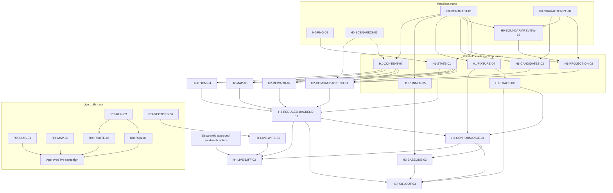

# Parallel Bridge and Headless Environment Execution Plan

> **Completed foundational plan.** Its accepted packets and contracts are
> preserved here as history. New implementation is governed by
> [the actor-ready successor plan](PHASE_1_ACTOR_READY_EXECUTION_PLAN.md) and
> the living [current status](../../STATUS.md).

- **Status date:** 2026-08-31
- **Live starting point:** `R0i`, bridge `0.8.0`, protocol `live_probe_v0`
- **Headless starting point:** deterministic legacy `CombatEnv` (`combat_v0`)
- **Target live build:** Slay the Spire 2 `v0.107.1`, Steam build `23811903`,
  macOS arm64
- **Intended executors:** separate non-ultra coding agents plus independent
  reviewers and one integration coordinator
- **Execution model:** dependency-driven parallel work in isolated worktrees;
  no fixed worker-count limit

This document turns the current bridge and headless-environment work into
bounded packets that separate coding agents can execute and hand back for
central review. It replaces the earlier live-first sequencing: real headless
implementation now starts immediately alongside bridge stabilization.

It is not authorization to install the bridge, launch the game, access a real
profile or credential, or conduct a live probe. It also does not claim that the
provisional headless simulator matches Slay the Spire 2.

## 1. Accepted execution decision

The project will advance on two independent but converging tracks:

1. **Live truth track.** Stabilize and extend the restricted project-owned
   bridge. The pinned game remains the semantic authority and supplies later
   differential evidence.
2. **Headless construction track.** Build a deterministic Python environment
   now: first a usable `combat_v0` episode backend, then a provisional reduced
   combat → reward → map → supported-room → next-combat run.

The bridge is not the high-throughput training engine. It is the live oracle,
integration path, and source of conformance evidence. The Python backend is the
counterfactual, resettable, snapshot-capable training and search environment.

Waiting for complete live evidence before building generic state, RNG,
snapshot, candidate, replay, and episode machinery would unnecessarily
serialize independent work. Conversely, calling structural Python rules
“game-accurate” before differential evidence would be misleading. The plan
therefore separates implementation progress from fidelity evidence.

Models and search remain outside this increment. The immediate objective is a
correctly bounded environment and episode interface that later policies and
planners can consume interchangeably.

## 2. Evidence and capability labels

Every implementation, fixture, manifest, trace, and handoff must use one of
these labels:

| Label | Meaning | Permitted claim |
| --- | --- | --- |
| `live_observed` | Demonstrated through an approved campaign on the pinned game | Only the exact named observation/action sequence |
| `bridge_fixture` | Demonstrated by bridge source, encoder tests, or disposable client fixtures | Current bridge implementation shape, not game truth |
| `combat_v0` | Executed by the existing Python combat simulator | Legacy simulator behavior only |
| `structural_fixture` | Project-authored reduced-run rule or synthetic fixture | Deterministic structural behavior, not target-game parity |
| `differential_verified` | Headless behavior matched an accepted live trace for a named case | Only the named mechanic/build/case corpus |

The following statements are forbidden until supported by later evidence:

- “the headless environment is Slay the Spire 2”;
- “full-run simulator parity”;
- “rest/event/reward/map rules are accurate” when they are only structural;
- “Phase 1 is complete” from fixture or headless evidence;
- “near optimal” from combat-only or reduced-content training; or
- “live compatible” merely because a Python object resembles a bridge payload.

## 3. Scalable concurrency model

There is no numeric worker cap. Start every task whose hard dependencies are
accepted and whose writable paths are exclusively owned. The practical limits
are semantic dependencies, review capacity, and merge order—not a fixed number
of agents.

Unlimited workers do not make these operations parallel:

- two revisions of the same shared contract;
- two writers to `apply_run_live.py`;
- a composed backend before its rules producers exist;
- conformance tests before the implementation under test exists; or
- integration-owned exports and documentation.

Every writer uses a separate worktree and `codex/` branch. Read-only reviewers
may inspect any branch. The coordinator supplies the exact starting commit,
accepts shared-contract fingerprints, merges in dependency order, runs the
aggregate test matrix, and updates shared documentation once.

### 3.1 Initial dispatch

All of these tasks may start immediately and concurrently:

- `R0I-DIAG-01`
- `R0I-MAP-02`
- `R0I-RUN-03`
- `R0I-VECTORS-06`
- `H0-CONTRACT-01`
- `H0-RNG-02`
- `H0-SCENARIOS-03`
- `H0-CHARACTERIZE-04`
- `H0-BOUNDARY-REVIEW-05` (read-only)

As soon as `H0-CONTRACT-01` is integrated and accepted for the experimental
slice, all ready `H1` tasks start; they do not wait for the bridge campaign.
Scheduling is continuous: a completed dependency releases its consumers
without waiting for unrelated tasks in the same visual row.

A worker can be dispatched with: “Execute task `<TASK-ID>` exactly as specified
in `docs/PHASE_1_PARALLEL_EXECUTION_PLAN.md`, starting from `<BASE-COMMIT>`.” The
task block and common rules are the complete brief; the worker must not absorb a
neighboring packet.

### 3.2 Cost-aware model and reasoning allocation

These are execution defaults for separate Codex tasks, not part of any game or
backend contract. They follow current
[official OpenAI model guidance](https://developers.openai.com/api/docs/models):
Sol is reserved for flagship complex work, Terra is the normal intelligence/
cost balance, and Luna is used for cost-sensitive bounded work. No task starts
at `xhigh`, `max`, or `ultra`; `high` is reserved for work where additional
reasoning is expected to prevent expensive downstream rework.

“Relative budget” estimates the combined reasoning/context/retry footprint, not
a fixed token allowance or a Codex billing promise. A cheaper model that needs
several repair turns can cost more overall than a stronger first pass, so the
allocation optimizes accepted-result cost rather than price per request alone.

| Task | Default model | Effort | Relative budget | Selection reason |
| --- | --- | --- | --- | --- |
| `R0I-DIAG-01` | `gpt-5.6-terra` | `high` | medium | Privacy-safe fail-closed taxonomy over a bounded validator |
| `R0I-MAP-02` | `gpt-5.6-luna` | `medium` | low | Patterned socket fixtures with only fixture-proven local fixes |
| `R0I-RUN-03` | `gpt-5.6-sol` | `high` | high | First mutating cross-client room handoff and reconciliation join |
| `R0I-RUN-04` | `gpt-5.6-terra` | `high` | medium | Narrow continuation over the accepted `R0I-RUN-03` seam |
| `R0I-ROUTE-05` | `gpt-5.6-luna` | `medium` | low | Isolated deterministic ranking and tie-break fixtures |
| `R0I-VECTORS-06` | `gpt-5.6-terra` | `medium` | medium-low | Exact but mechanical encoder/receipt binding with byte tests |
| `R0I-ROOM-LIFECYCLE-07` | `gpt-5.6-sol` | `high` | high | User-approved foreground eligibility/completion repair after live failures |
| `H0-CONTRACT-01` | `gpt-5.6-sol` | `high` | high | Highest-fan-out shared contract and canonical binding semantics |
| `H0-RNG-02` | `gpt-5.6-terra` | `high` | medium | Subtle determinism/snapshot work contained by exact property tests |
| `H0-SCENARIOS-03` | `gpt-5.6-luna` | `medium` | low | Closed adapter and validation over existing factory APIs |
| `H0-CHARACTERIZE-04` | `gpt-5.6-terra` | `medium` | medium-low | Focused black-box tests with no production semantics |
| `H0-BOUNDARY-REVIEW-05` | `gpt-5.6-sol` | `high` | high | Independent public-information and control-boundary review |
| `H1-STATE-01` | `gpt-5.6-sol` | `high` | high | Durable identity, snapshots, RNG ownership, and combat seam |
| `H1-PROJECTION-02` | `gpt-5.6-sol` | `high` | high | Actor-facing information firewall and negative leakage tests |
| `H1-CANDIDATES-03` | `gpt-5.6-terra` | `high` | medium | Legal-action bijection is subtle but bounded and conformance-gated |
| `H1-FIXTURE-04` | `gpt-5.6-terra` | `medium` | medium-low | Frozen corpus and capabilities constrained by exact fixtures |
| `H1-RUNNER-05` | `gpt-5.6-terra` | `medium` | medium-low | Generic loop over an already accepted contract |
| `H1-TRACE-06` | `gpt-5.6-sol` | `high` | high | First policy/target/audit schema and immutable cross-stream binding |
| `H1-CONTENT-07` | `gpt-5.6-terra` | `medium` | medium-low | Closed materializer/content table with deterministic tests |
| `H2-COMBAT-BACKEND-01` | `gpt-5.6-sol` | `high` | high | Legacy adapter, persistent handoff, replay, and snapshot join |
| `H2-REWARD-02` | `gpt-5.6-terra` | `high` | medium | Persistent mutation, RNG ordering, and atomic rejection |
| `H2-MAP-03` | `gpt-5.6-luna` | `medium` | low | Small explicit DAG with stable-ID and legality fixtures |
| `H2-ROOM-04` | `gpt-5.6-terra` | `high` | medium | Persistent event mutation, RNG/public boundary, and snapshots |
| `H3-REDUCED-BACKEND-01` | `gpt-5.6-sol` | `high` | high | Main state-machine, snapshot, evidence, and process-factory join |
| `H3-BASELINE-02` | `gpt-5.6-luna` | `medium` | low | Deliberately simple post-conformance public-candidate choosers |
| `H3-ROLLOUT-03` | `gpt-5.6-terra` | `high` | medium | Spawn safety, seed partitioning, interruption, and record binding |
| `H3-CONFORMANCE-04` | `gpt-5.6-sol` | `high` | high | Independent adversarial verification of every backend claim |
| `H4-LIVE-WIRE-01` | `gpt-5.6-terra` | `high` | medium | Strict wire parsing and public/control/audit separation |
| `H4-LIVE-DIFF-02` | `gpt-5.6-sol` | `high` | high | Cross-contract evidence, privacy, and fidelity-promotion boundary |

The coordinator uses `gpt-5.6-sol` at `high` only for contract acceptance,
high-risk integration joins, disputed semantic review, and final conformance
interpretation. Routine ownership checks, clean merges, and deterministic test
reruns do not need a separate flagship-model task.

#### Token-control and escalation rules

1. Start each worker with only the task ID, exact base commit, task brief, and
   repository reading order. Do not copy the full coordinator conversation.
2. Give one focused repair cycle at the assigned model/effort. A second failure
   with the same root cause stops the task and returns minimized evidence.
3. Escalate Luna to Terra `high` only for a shared-state, identity, snapshot,
   protocol, or reconciliation ambiguity. Raise Terra `medium` to Terra `high`
   when the issue stays inside the accepted contract but needs more semantic
   reasoning. Escalate Terra `high` to Sol `high` only for a cross-contract
   conflict, public-information leak, replay divergence, or evidence/capability
   dispute.
4. A required accepted-contract change is not a model escalation: stop and
   return it to the contract/coordinator owner.
5. `xhigh` requires a coordinator decision for one minimized disputed invariant.
   `max` and `ultra` are excluded from this plan unless the user explicitly
   changes the cost policy.
6. Changing model or reasoning effort never grants authority for a contract
   revision, live install/launch/capture, or profile/credential/Cloud access.
7. Reviewers receive the diff, consumed contract fingerprints, focused test
   output, and handoff—not another worker's full transcript.
8. After the initial dispatch, compare first-pass acceptance, repair cycles,
   elapsed time, and token metrics when the host exposes them. Promote or
   downgrade a task class only from that evidence; test one reasoning level
   lower on a later representative task before adopting a cheaper default.

## 4. Provisional headless contract freeze

`headless_v0` is accepted as the target of `H0-CONTRACT-01` for this experimental
increment. The code artifact and fingerprint do not exist yet, but the semantic
boundary below is frozen so the contract owner does not need to make broad
architectural choices alone.

### 4.1 Backend operations

The provisional backend exposes:

- `reset(configuration) -> DecisionState`;
- `observe() -> DecisionState`;
- `apply(ActionRequest) -> Transition`;
- `snapshot()` and `restore(snapshot)` when the manifest advertises them;
- `manifest() -> BackendManifest`; and
- `close()`.

Applying one decision runs automatic consequences until the next decision,
unsupported boundary, or terminal state. UI polling is not a headless policy
transition.

### 4.2 Decision and action boundary

An actionable `DecisionState` contains:

- contract, backend, content, and rules versions/fingerprints;
- opaque run ID and monotonic decision sequence;
- status and phase;
- normalized public observation;
- all and only legal typed candidates;
- a canonical decision hash; and
- optional public events since the previous decision.

An `ActionRequest` uses a `HeadlessBinding` to bind one candidate ID to the
expected run, sequence, and decision hash. Candidate IDs are stable only for
that decision. Hand, enemy, reward, and map list positions never become durable
run entity identity.

The live wire has a deliberately different `BridgeBinding`: protocol plus the
bridge's decision-scoped ID. Current `live_probe_v0` responses do not contain a
headless run ID, monotonic sequence, or headless decision hash. A live parser
must preserve that absence; it must not manufacture headless identity. The two
families can be compared only through an explicitly defined common public
subset.

The initial typed candidate subset is:

- combat play-card and end-turn;
- reward claim-gold, open-card-reward, choose-card, skip-card, and proceed;
- map choose-node;
- room rest-heal, event-option, and proceed.

`Transition` reports accepted, rejected, or stale; normalized public events;
and the next decision/terminal boundary. The canonical contract contains no
scalar shaped RL reward. The existing `CombatEnv` shaped reward may be retained
as explicitly labelled adapter diagnostics.

### 4.3 Combat composition seam

The persistent run and the legacy combat simulator meet through two serializable
internal adapter messages owned by the state packet:

- `CombatLaunchSpec`: encounter/scenario reference, combat seed, current and
  maximum HP, combat settings, and the ordered supported persistent card
  instances to materialize into a combat deck; and
- `CombatResolution`: outcome, final HP, and the accepted combat-history/replay
  reference needed for deterministic recovery. In this slice, final HP is the
  only combat-produced persistent state delta.

Combat preserves the ordered persistent master-deck instance IDs and definition
IDs exactly. Draw/discard/exhaust movement and combat-generated temporary cards
such as `Slimed` never modify that master deck; supported reward rules are the
only rules in this slice that may add persistent card instances.

The state kernel is the sole allocator and validator of durable run, card, and
map identity. Phase rules decide *when* an entity is created or referenced, but
consume that shared identity service rather than defining another allocator.
The content packet owns the closed card-definition-to-`combat_v0` materializer;
the combat backend consumes it. The state kernel owns the world RNG service and
the reduced-run composer advances it exactly once when constructing a
`CombatLaunchSpec`; the combat backend consumes the supplied combat seed and
never advances the world RNG. These adapter messages are private engine data,
not policy observations or claims about a live-game save format.

The state schema also freezes separate named world streams for at least
`combat_launch`, `reward_offer`, and `event_effect`, each with its own counter.
The reduced map is non-random in this slice. A rule consumes only its named
stream, so unrelated phase actions cannot perturb another phase's future draws;
snapshots preserve every stream state and counter.

### 4.4 State and information boundary

- `WorldState` is internal and contains hidden synthetic state, RNG state,
  pending decisions, and automatic progression.
- A private world snapshot retains all state needed for exact continuation.
  Public projection is a separate type and method; a snapshot is never a policy
  serialization format.
- `PublicObservation` is the only state supplied to a chooser or future model.
- Control tokens, decision hashes, receipts, snapshot keys, RNG state, hidden
  offers, and future outcomes are not policy features.
- Policy RNG is separate from game RNG.

### 4.5 Capability truthfulness

Each backend manifest declares per-phase support and at least:

- evidence label;
- deterministic reset;
- counterfactual stepping;
- fixture playback;
- snapshot/restore;
- live truth;
- supported/unsupported phases; and
- legacy shaped-reward diagnostics.

The first combat adapter advertises `combat_v0`, `live_truth=false`, and only
combat support. The reduced simulator advertises `structural_fixture` for
reward/map/room behavior until named differential fixtures pass.

## 5. Dependency graph

The graph deliberately has several semantic join points, especially combat
materialization, reduced-run composition, conformance, and live differential
comparison. Do not create competing implementations merely to occupy more
workers. For legibility, some transitive edges are omitted; every dependency
listed in an individual task block remains hard even when an upstream path is
already visible in the graph.

## 6. Live bridge work packets

### `R0I-DIAG-01` — Classify combat decision mismatch safely

- **Outcome:** Replace opaque combat-decision validation failure with a fixed,
  sanitized structural taxonomy without changing accepted payload semantics.
- **Context:** `decision_response_mismatch` comes from
  `probe_live.py::_validate_combat`; the cause is not yet known.
- **Inputs:** current status, `live_probe_v0`, combat encoder tests.
- **Dependencies:** none.
- **In scope:** Envelope/identity, player, enemies, hand, legal-action, and
  provider-result categories; minimized synthetic fixtures; strict duplicate
  and unknown-field rejection.
- **Out of scope:** Retry/timing changes, C# changes, raw logging, live access,
  and claiming the original failure is fixed.
- **Owned files:** `bridge/Sts2AgentBridge/tools/probe_live.py` and
  `bridge/Sts2AgentBridge/tools/probe_live_fixtures.py`.
- **Read-only dependencies:** all other bridge files.
- **Contract:** `live_probe_v0` schema `1`; local error taxonomy only.
- **Acceptance:** Every invalid fixture reaches one category; valid fixtures
  normalize unchanged; output contains no raw body, token, path, correlation
  ID, card text, or enemy text.
- **Docs:** coordinator-owned.
- **Risk:** high.
- **Approval:** disposable fixtures only; no live authorization.
- **Handoff:** commit, category table, compatibility note, commands/results,
  and unclassified cases.

### `R0I-MAP-02` — Add map-client fixture parity

- **Outcome:** Give `apply_map_live.py` a socket-level fixture suite comparable
  to the other mutation clients.
- **Context:** Map is on the composed critical path but lacks a dedicated
  client fixture file.
- **Inputs:** map client, room/reward fixture patterns, C# map contract.
- **Dependencies:** none.
- **In scope:** Ready/waiting/unsupported/complete; exact requests; accepted,
  stale, already-applied, and rejected receipts; mismatch and cleanup cases;
  only defects directly exposed by the suite.
- **Out of scope:** Route policy, new map kinds/routes, C# changes, live use.
- **Owned files:** `bridge/Sts2AgentBridge/tools/apply_map_live.py` and new
  `bridge/Sts2AgentBridge/tools/apply_map_live_fixtures.py`.
- **Read-only dependencies:** bridge probe/provider/public reader files.
- **Contract:** existing map decision/action schema `1`.
- **Acceptance:** Entire suite runs in memory, exact canonicalization passes,
  and every production fix has a failing-before fixture.
- **Docs:** coordinator-owned.
- **Risk:** medium-high.
- **Approval:** no live authorization.
- **Handoff:** commit, check inventory, results, defects, limitations.

### `R0I-RUN-03` — Add one safe room handoff

- **Outcome:** From one rest-site or ancient map destination, invoke the frozen
  safe room client, require matching room kind, wait for the next map, and stop
  at a successful bounded boundary.
- **Context:** The current batched runner never invokes the room client.
- **Inputs:** granular client result shapes and current run fixtures.
- **Dependencies:** fixture dependency on the unchanged
  `apply_room_live._run_apply_room` interface.
- **In scope:** Explicit safe room provider; `rest_site` → `rest_site` check;
  `ancient` as a hint that must resolve to `event`; map-ready termination;
  unchanged monster path; synthetic rest/event/mismatch/unsupported cases.
- **Out of scope:** Arbitrary room loops, second map selection, shops, elites,
  bosses, C# changes, live use.
- **Owned files:** `bridge/Sts2AgentBridge/tools/apply_run_live.py` and
  `bridge/Sts2AgentBridge/tools/apply_run_live_fixtures.py`.
- **Read-only dependencies:** all granular clients/providers.
- **Contract:** additive local runner CLI/result revision only.
- **Acceptance:** Rest and safe event reach a verified map-ready stop; wrong or
  unsupported screens fail closed; monster behavior and cleanup remain intact.
- **Docs:** coordinator-owned.
- **Risk:** high.
- **Approval:** fixtures only.
- **Handoff:** commit, CLI/result delta, transition matrix, results, limits.

### `R0I-RUN-04` — Continue from one room to the next combat

- **Outcome:** Extend the accepted one-room handoff with exactly one further map
  selection and resume an ordinary combat.
- **Context:** This is the smallest continuation required for the multi-combat
  live target without creating a general travel planner.
- **Inputs:** integrated `R0I-RUN-03`.
- **Dependencies:** hard on `R0I-RUN-03`.
- **In scope:** One post-room map action; continue only for `monster`; wait for
  new combat; preserve room record and limits; fail on a second room or other
  unsupported destination.
- **Out of scope:** Recursive/multi-room traversal, route planning, unsupported
  phases, C# changes, live use.
- **Owned files:** the same two run files, but only after `R0I-RUN-03` ownership
  is released and its commit is integrated.
- **Read-only dependencies:** granular clients/providers.
- **Contract:** accepted local runner revision from `R0I-RUN-03`.
- **Acceptance:** Rest/event → map → monster → next combat fixtures; cap,
  unsupported, second-room, terminal, and cleanup cases.
- **Docs:** coordinator-owned.
- **Risk:** high.
- **Approval:** fixtures only.
- **Handoff:** commit, delta, transition matrix, results, unsupported routes.

### `R0I-ROUTE-05` — Target supported room coverage deterministically

- **Outcome:** Make `coverage` prefer `rest_site`, then `ancient`, then
  `monster`, retaining deterministic tie-breaking and unchanged other providers.
- **Context:** Current ranking favors `unknown` before combat and does not favor
  ancient nodes.
- **Inputs:** integrated `R0I-RUN-03` transition matrix and frozen
  `R0I-RUN-04` destination behavior.
- **Dependencies:** hard on `R0I-RUN-03`; advisory on `R0I-RUN-04`. It may run
  concurrently with `R0I-RUN-04` because paths are disjoint.
- **In scope:** Priority/tie-break fixtures and legal-action alignment. Ancient
  remains a hint; the room client must prove `event`.
- **Out of scope:** Full route planning, new providers, shops/elites/bosses.
- **Owned files:** `bridge/Sts2AgentBridge/tools/decision_providers.py` and
  `bridge/Sts2AgentBridge/tools/decision_providers_fixtures.py`.
- **Read-only dependencies:** map/run/room clients.
- **Contract:** existing provider surface; `coverage` behavior delta only.
- **Acceptance:** Priority, fallback, legality, and unchanged-provider fixtures.
- **Docs:** coordinator-owned.
- **Risk:** medium.
- **Approval:** no live use before campaign approval.
- **Handoff:** commit, old/new priorities, results.

### `R0I-VECTORS-06` — Bind public decision and receipt bodies to golden vectors

- **Outcome:** Add exact combat/reward/map/room decision and action-receipt
  vectors needed by the later strict live wire parser.
- **Context:** Encoder tests contain these shapes, but the checked-in vector
  directory currently covers only health/manifest/screen/error bodies.
- **Inputs:** canonical C# encoder/public models.
- **Dependencies:** none for implementation; advisory on bridge changes. It is
  not a live-campaign gate.
- **In scope:** Canonical `.json` bodies for ready/waiting/unsupported/complete
  cases where valid; for every action family, receipts covering `accepted`,
  `stale_decision`, `invalid_action`, `already_applied`, and
  `action_limit_reached`; byte binding in the existing artifact test suite.
  `backend_fault` remains an HTTP error represented by the existing 500/503
  vectors, not a normal action receipt.
- **Out of scope:** HTTP expansion, new fields, Python code, captured live
  bodies.
- **Owned files:** new R0i vectors and
  `ContractArtifactBindingTestSuite.cs`.
- **Read-only dependencies:** production C# and existing contract tests.
- **Contract:** current `live_probe_v0` schema `1`.
- **Acceptance:** Encoder bytes equal artifacts; inventory/hashes recorded; all
  bridge tests pass.
- **Docs:** coordinator-owned.
- **Risk:** medium.
- **Approval:** synthetic public data only.
- **Handoff:** commit, vector hashes, tests, missing shapes.

### `R0I-ROOM-LIFECYCLE-07` — Bind room actions and completion to the active surface

- **Authorization:** Added 2026-09-04 after the user explicitly approved the
  narrow C# room/map lifecycle repair, unchanged replay protections, independent
  review, and another bounded coordinator-only live check. This does not remove
  the C# exclusions from `R0I-RUN-03/04` or authorize unrelated event-identity
  redesign.
- **Outcome:** Do not advertise or apply underlying room actions while the map
  is foreground; recognize only correctly bound room-to-map completion despite
  persistent underlying room nodes.
- **Inputs:** accepted bridge `0.8.0`, Python preflight `f74cf26`, and sanitized
  2026-09-04 live observations in the acceptance record.
- **Dependencies:** hard on the accepted existing room/map readers/appliers and
  the integrated Python readiness repair. Independent of headless rollout work.
- **In scope:** Public active-surface eligibility, immediate action revalidation,
  bounded same-room accepted-action/completion bookkeeping, and pure synthetic
  lifecycle seams/tests. Prefer already allowlisted public map state. Map-open
  alone must not prove completion; distinguish inspection-only opening from
  completed-room travel readiness and bind it to the observed/accepted room.
- **Out of scope:** New wire fields/statuses, changed decision hashing, resetting
  replay history, retrying uncertain POSTs, event-step generation redesign,
  shops/potions/route planning, profiles/saves/Cloud, or worker live use.
- **Owned files:**
  `src/Sts2AgentBridge/Adapters/Public/PinnedPublicRoomDecisionReader.cs`,
  `src/Sts2AgentBridge/Adapters/Public/PinnedPublicRoomActionApplier.cs`, optional
  new `src/Sts2AgentBridge/Adapters/Public/PublicRoomSurfaceLifecycle.cs`, and
  `tests/Sts2AgentBridge.Tests/Public/RoomInteractionTestSuite.cs`, all under
  `bridge/Sts2AgentBridge/`.
- **Forbidden overlap:** All other bridge files, public wire models/encoders,
  golden vectors, verifier policy/implementation, package version/identity,
  deployment manager, Python controllers, headless files, and shared docs.
  A required additional public member, wire change, or owned-file expansion
  requires a coordinator proposal before implementation.
- **Contract:** Existing `live_probe_v0` schema 1 and byte encoders unchanged;
  candidate/decision/replay identity and all action caps remain unchanged.
  Internal lifecycle evidence is not added to policy or wire payloads. The
  coordinator reviews the completion predicate before acceptance; if available
  public state cannot distinguish inspection from exit, preserve fail-closed
  behavior and report that limitation rather than inventing evidence.
- **Reviewed predicate:** Map completion is rest-only: accepted literal rest
  `proceed` in the same current run/room, map open and travel-enabled, not
  traveling, without nested/custom/ambiguous content. Event-to-map completion
  remains fail-closed. Internal identity bookkeeping retains at most 1,000
  numeric run/room pairs with immutable first kind/ordinal and no eviction,
  reset, or Godot-node retention. Absence and revisits clear volatile completion
  evidence without minting a new identity for an already accepted action;
  known pairs remain recognizable at capacity and conflicting kinds fail closed.
- **Acceptance:** Foreground map plus persistent rest/event nodes yields no room
  candidates or clicks; stale request revalidation prevents behind-map actions;
  inspection-only map before/after a non-exit action cannot complete a room;
  accepted supported exit with travel-ready map completes only its bound room;
  map open/close/travel transitions, wrong/new room, nested/custom content,
  pending unchanged projection, replay and action caps retain fail-closed tests.
  Existing C# contract tests and surface gate pass. Any live claim additionally
  requires a newly reproduced/package-verified artifact, bounded coordinator
  verification, and full clean teardown.
- **Docs/package ownership:** Coordinator records the predicate decision,
  artifact identity, any explicit verifier-policy proposal, deployment pins,
  and sanitized evidence. Workers must not update pins to bypass a failed gate.
- **Risk:** High action-semantics and completion-evidence risk.
- **Handoff:** Focused commit, exact predicate/truth table, tests and failing-
  before cases, contract delta (expected none), unsupported residuals, aggregate
  usage. Worker must not launch/install/access real credentials or profiles.

## 7. Immediate headless root packets

### `H0-CONTRACT-01` — Implement the provisional `headless_v0` contract

- **Outcome:** Produce the executable types and codecs for the contract frozen
  in Section 4, with inline codec/hash test vectors.
- **Context:** This is the one short shared seed that unlocks most headless
  lanes. It is provisional but accepted for this experimental slice.
- **Inputs:** D37, this document, current structured combat observations, R0i
  public decision families as read-only shape references.
- **Dependencies:** none; one exclusive contract writer.
- **In scope:** Manifest/capabilities, decision status/phase, public
  observation container, typed candidates, action request, transition/events,
  canonical serialization and decision hashing, strict validation.
- **Out of scope:** Rules, backend implementation, live parser/networking,
  `WorldState`, shared playback fixtures, scalar reward, model tensors, public
  exports.
- **Owned files:** new `game/contracts/headless_v0.py` and
  `tests/contracts/test_headless_v0.py` only.
- **Read-only dependencies:** all existing code/docs.
- **Contract:** `headless_v0`, initially `accepted for slice` only after
  coordinator and independent review accept the exact fingerprint.
- **Acceptance:** JSON round-trip; stable canonical hashes; hash changes when
  decision/public/candidate data changes; duplicate candidates and unknown
  fields fail; control/audit/RNG fields cannot enter policy view.
- **Docs:** no shared docs; handoff contains the contract change packet.
- **Risk:** high.
- **Approval:** repository-local only.
- **Handoff:** commit, fingerprint, type/candidate matrix, allowlist,
  compatibility class, inline test-vector results, freeze notice.

### `H0-RNG-02` — Build deterministic named RNG and snapshots

- **Outcome:** Provide a game-randomness service with named streams,
  deterministic draws, JSON-safe snapshot/restore, and no policy-RNG coupling.
- **Context:** State/progression/search need explicit reproducible randomness;
  exact STS2 RNG equivalence is not claimed.
- **Inputs:** current seeded simulator behavior and long-term RNG requirements.
- **Dependencies:** none; the module must not import the provisional contract.
- **In scope:** Project-authored `python_mt19937_v1` streams; integer/choice/
  shuffle operations needed by the reduced slice; request counters; state
  serialization; version rejection.
- **Out of scope:** Claiming target-game RNG domains/order, policy sampling,
  global RNG, cryptography, performance optimization.
- **Owned files:** new `game/engine/random_service.py` and
  `tests/engine/test_random_service.py`.
- **Read-only dependencies:** simulation RNG utilities/tests.
- **Contract:** internal RNG schema `python_mt19937_v1` with evidence
  `structural_fixture`.
- **Acceptance:** Same seed/calls match; snapshot continuation is exact; stream
  isolation holds; unrelated policy RNG cannot change game outcomes; malformed
  or version-mismatched snapshots reject.
- **Docs:** coordinator-owned.
- **Risk:** high.
- **Approval:** local tests only.
- **Handoff:** commit, RNG API/domain table, snapshot schema, tests/results,
  parity disclaimer.

### `H0-SCENARIOS-03` — Add named deterministic combat scenarios

- **Outcome:** Define serializable scenario descriptors that create existing
  `CombatEnv` configurations without changing combat rules.
- **Context:** A headless backend needs reproducible reset inputs rather than
  arbitrary Python callables.
- **Inputs:** `CombatEnvFactory`, supported encounter/deck registries.
- **Dependencies:** none.
- **In scope:** Named scenario ID, encounter/deck, factory-supported maximum
  player/enemy HP where relevant, cards-per-turn, shaping/recording settings,
  seed, strict validation, and deterministic construction through the factory's
  existing named deck/encounter surface. Energy remains fixed at the current
  factory-created combat default.
- **Out of scope:** New cards/enemies, full run state, upgrades/relics/potions,
  arbitrary master decks, non-default current HP, and edits to
  `game/simulation/**`. Persistent deck/HP construction belongs to the
  project-authored state/content/combat adapter seam.
- **Owned files:** new `game/backends/headless/scenarios.py` and
  `tests/backends/headless/test_scenarios.py`.
- **Read-only dependencies:** simulation factories/registries/tests.
- **Contract:** scenario schema `combat_v0_scenario_v1`, evidence `combat_v0`.
- **Acceptance:** Every named scenario is serializable and deterministic; bad
  IDs/settings reject; same descriptor/seed produces the same initial structured
  observation; no simulation file changes.
- **Docs:** coordinator-owned.
- **Risk:** medium.
- **Approval:** local tests only.
- **Handoff:** commit, scenario inventory/schema, tests/results, omissions.

### `H0-CHARACTERIZE-04` — Freeze black-box `CombatEnv` behavior

- **Outcome:** Add fixed-seed characterization tests for existing structured
  observations, legal actions, terminal outcomes, and shaped diagnostics.
- **Context:** Adapter workers need a regression oracle that is independent of
  their new code.
- **Inputs:** public `CombatEnv`/factory APIs and existing tests.
- **Dependencies:** none.
- **In scope:** Representative single/multi-enemy traces; legal-action
  completeness; reset determinism; victory/defeat; observation mutation checks;
  explicit inventory of potentially non-public legacy fields.
- **Out of scope:** Production changes, encoding/tensor checks, live parity,
  asserting hidden legacy fields are deployable policy inputs.
- **Owned files:** new
  `tests/backends/headless/test_combat_v0_characterization.py` only.
- **Read-only dependencies:** current simulation code/tests.
- **Contract:** existing `combat_v0` behavior.
- **Acceptance:** Stable golden summaries and action traces; existing suite
  remains unchanged; field audit included in test names/comments and handoff.
- **Docs:** none.
- **Risk:** low-medium.
- **Approval:** local tests only.
- **Handoff:** commit, characterized cases/fields, commands/results, ambiguities.

### `H0-BOUNDARY-REVIEW-05` — Independent public-boundary review

- **Outcome:** Review the provisional contract and legacy observation fields
  before actor-facing projections are accepted.
- **Context:** Current combat observations contain simulator-oriented fields
  such as enemy behavior state that may not belong in a live-compatible actor
  view.
- **Inputs:** `H0-CONTRACT-01` handoff/branch,
  `H0-CHARACTERIZE-04` handoff, bridge public combat model, and `CombatEnv`
  observation/encoder.
- **Dependencies:** the reviewer is read-only and may begin immediately, but a
  final accepted verdict is hard on the contract and characterization handoffs.
- **In scope:** Field-by-field public/legacy-hidden/control/audit classification;
  candidate lifetime; required negative tests.
- **Out of scope:** Edits or contract acceptance.
- **Owned files:** none; handoff report only.
- **Contract:** exact proposed `headless_v0` fingerprint under review.
- **Acceptance:** Source-referenced matrix and blocking/non-blocking findings.
- **Docs:** none.
- **Risk:** low operational, high information-integrity value.
- **Approval:** read-only.
- **Handoff:** verdict, matrix, counterexamples, required changes.

## 8. Parallel headless component packets

These start as soon as their named roots are integrated. They need not wait for
one another unless a hard dependency says so.

### `H1-STATE-01` — Private run state, combat seam, and snapshot kernel

- **Outcome:** Implement the minimal persistent state and combat handoff needed
  by the reduced counterfactual run, including exact private snapshot/restore
  and semantic keys.
- **Inputs:** accepted `headless_v0`, `H0-RNG-02`.
- **Dependencies:** hard on contract and RNG fingerprints.
- **In scope:** The sole allocator/validator for stable run/card/map IDs; HP,
  gold, master-deck card instances, phase, node/history, pending decision,
  terminal result, automatic queue, RNG snapshot, `CombatLaunchSpec`,
  `CombatResolution`, a private world-snapshot codec, and versioned semantic
  key; the versioned `combat_launch`/`reward_offer`/`event_effect` stream map and
  counters.
- **Out of scope:** Combat internals, rule execution, broad relic/potion/content,
  public-observation projection/serialization, policy state, and live save
  compatibility.
- **Owned files:** new `game/engine/headless_state.py`,
  `game/engine/snapshots.py`, `tests/engine/test_headless_state.py`, and
  `tests/engine/test_headless_snapshots.py`.
- **Read-only dependencies:** contract/RNG modules.
- **Contract:** exact accepted `headless_v0`; state schema
  `reduced_world_state_v0`.
- **Acceptance:** Private snapshot round-trip and continuation equality;
  deterministic ID allocation; launch/resolution round-trips and validate HP,
  deck, seed, and the HP-only combat persistence invariant; named-stream
  counters restore exactly and cross-stream isolation holds; incompatible
  fingerprints reject; type/API tests keep private snapshots distinct from
  `PublicObservation`.
- **Docs:** coordinator-owned.
- **Risk:** high.
- **Approval:** local tests only.
- **Handoff:** commit, state inventory, key/snapshot definitions, tests/results.

### `H1-PROJECTION-02` — Project legacy combat into public decisions

- **Outcome:** Convert structured `CombatEnv` observations into the accepted
  public combat observation without leaking legacy simulator internals.
- **Inputs:** accepted contract, characterization results, boundary review.
- **Dependencies:** hard on contract, accepted characterization fixtures, and
  an accepted `H0-BOUNDARY-REVIEW-05` verdict; blocking boundary findings must
  be resolved first.
- **In scope:** Player, visible enemy/intents, hand, pile counts, turn, terminal
  projection; allowlist and negative leakage tests.
- **Out of scope:** Candidate generation, stepping, fixed-width encoding,
  representation tensors, simulation changes.
- **Owned files:** new `game/backends/headless/combat_projection.py` and
  `tests/backends/headless/test_combat_projection.py`.
- **Read-only dependencies:** simulation observation and bridge public model.
- **Contract:** accepted combat subset of `headless_v0`, evidence `combat_v0`.
- **Acceptance:** Stable strict projection; input mutation cannot alter output;
  behavior/RNG/control/future fields are excluded or explicitly legacy-labelled
  outside policy view.
- **Docs:** coordinator-owned.
- **Risk:** high information-boundary risk.
- **Approval:** local tests only.
- **Handoff:** commit, field allowlist/denylist, tests/results.

### `H1-CANDIDATES-03` — Map all legacy legal actions to typed candidates

- **Outcome:** Provide sound and complete decision-scoped candidate generation
  and decoding for `CombatEnv`.
- **Inputs:** accepted contract and characterization traces.
- **Dependencies:** hard on contract and accepted characterization fixtures.
- **In scope:** End-turn and play-card with zero/one target; single/multi-enemy
  cases; deterministic candidate IDs; request binding; stale/unadvertised
  rejection.
- **Out of scope:** Backend loop, durable card identity, fixed global action
  indices, new actions, simulation changes.
- **Owned files:** new `game/backends/headless/combat_candidates.py` and
  `tests/backends/headless/test_combat_candidates.py`.
- **Read-only dependencies:** simulation actions/core.
- **Contract:** accepted combat candidate subset; IDs live for one decision.
- **Acceptance:** Every candidate maps to exactly one legal tuple action and
  every legal tuple action appears once; ordering does not change semantic
  mapping; stale and tampered IDs reject.
- **Docs:** coordinator-owned.
- **Risk:** high action-semantics risk.
- **Approval:** local tests only.
- **Handoff:** commit, mapping/lifetime table, tests/results.

### `H1-FIXTURE-04` — Build fixture playback backend and frozen corpus

- **Outcome:** Provide deterministic playback of synthetic decision/action/
  transition sequences for contract and runner tests.
- **Inputs:** accepted contract and existing bridge fixture behavior as
  read-only inspiration.
- **Dependencies:** hard on contract.
- **In scope:** Named fixture reset, observe, apply recorded advertised action,
  stale/illegal rejection, cursor snapshot, truthful manifest; corpus with
  combat/reward/map/rest/event/unsupported paths.
- **Out of scope:** Counterfactual rules, live client, raw live data, simulator
  claims.
- **Owned files:** new `game/backends/headless/fixture_backend.py`,
  `tests/backends/headless/test_fixture_backend.py`, and
  `tests/fixtures/headless_v0/**` exclusively.
- **Read-only dependencies:** contract and bridge fixtures.
- **Contract:** exact `headless_v0`, evidence `structural_fixture`,
  `counterfactual=false`.
- **Acceptance:** Deterministic playback; only recorded candidates accepted;
  cursor restore exact; manifest says fixture-only/live-false.
- **Docs:** coordinator-owned.
- **Risk:** medium.
- **Approval:** synthetic fixtures only.
- **Handoff:** commit, fixture hashes/routes, capabilities, tests/results.

### `H1-RUNNER-05` — Generic episode runner

- **Outcome:** Execute any conforming backend to terminal, unsupported, or
  budget boundary using a caller-supplied chooser.
- **Inputs:** accepted contract; test-local fake backend.
- **Dependencies:** hard on contract only.
- **In scope:** Reset/observe/apply loop; action membership guard; monotonic
  decision validation; transition budget; structured result and stop reasons;
  chooser sees public decision/candidates only.
- **Out of scope:** Policy, heuristic ranking, search, Gym API, bridge network,
  training algorithm.
- **Owned files:** new `game/runtime/decision_chooser.py`,
  `game/runtime/episode_runner.py`, and
  `tests/runtime/test_episode_runner.py`.
- **Read-only dependencies:** contract.
- **Contract:** accepted `headless_v0`.
- **Acceptance:** Deterministic fake episodes; unadvertised choice fails safely;
  terminal/unsupported/budget stops; chooser receives no control/world state;
  runner does not consume game RNG.
- **Docs:** coordinator-owned.
- **Risk:** medium.
- **Approval:** local tests only.
- **Handoff:** commit, API, stop matrix, tests/results.

### `H1-TRACE-06` — Policy replay, target, and audit records

- **Outcome:** Record deterministic policy-visible episode data while
  physically and type-wise separating hindsight targets and operational audit
  information.
- **Inputs:** accepted contract and fixture decisions.
- **Dependencies:** hard on contract and `H1-FIXTURE-04`.
- **In scope:** Policy-replay JSONL containing only each boundary's then-current
  public decision/candidates/chosen action/public events; a separate
  outcome/target sidecar containing terminal labels as explicitly marked
  hindsight; a separate synthetic audit sidecar with local sequence, decision
  correlation and receipt; interruption detection; and one immutable trajectory
  manifest binding all streams by trajectory ID, roles, contract/backend/
  content/rules fingerprints, evidence labels, and finalized stream hashes.
- **Out of scope:** Raw live payloads or live control hashes, privileged state,
  live audit output, model-generated targets, logits, search targets,
  training-dataset publication, and dataset sharding.
- **Owned files:** new `game/data/headless_trajectory.py` and
  `tests/data/test_headless_trajectory.py`.
- **Read-only dependencies:** contract/fixtures.
- **Contract:** trajectory schema `headless_trajectory_v0`.
- **Acceptance:** Golden deterministic outputs; policy replay contains no
  control token, receipt, RNG, snapshot key, hidden offer, future state, or
  terminal hindsight before it becomes observable; neither target nor audit
  records can be passed as policy view; swapping, truncating, or modifying any
  stream breaks manifest validation.
- **Docs:** coordinator-owned.
- **Risk:** high data-boundary risk.
- **Approval:** fixtures only; live audit requires separate review/approval.
- **Handoff:** commit, schemas/examples, privacy tests/results.

### `H1-CONTENT-07` — Declare reduced structural content

- **Outcome:** Define the small project-authored content set used by the first
  counterfactual reduced run.
- **Inputs:** current supported combat cards/encounters and the R0i-supported
  phase verbs.
- **Dependencies:** hard on contract candidate kinds and accepted
  `H0-SCENARIOS-03` IDs; no live dependency.
- **In scope:** Supported card factory references and a closed, project-authored
  top-level/pickle-safe card-definition-to-`combat_v0` materializer; ordered
  references to at least two accepted `H0-SCENARIOS-03` IDs rather than another
  scenario registry; small explicit map templates; gold/card reward tables;
  rest-heal rule parameters; whitelisted safe event definitions; content
  fingerprint.
- **Out of scope:** Exact game probabilities, extracted proprietary content,
  shops, potions, upgrades, broad events, procedural parity.
- **Owned files:** new `game/content/reduced_v0.py` and
  `tests/content/test_reduced_v0.py`.
- **Read-only dependencies:** simulation card/deck/encounter registries.
- **Contract:** content manifest `reduced_content_v0`, evidence
  `structural_fixture`.
- **Acceptance:** Stable manifest/fingerprint; every supported serialized card
  definition materializes deterministically and unsupported definitions reject;
  all references resolve; no asset or game-file dependency; unsupported content
  explicit.
- **Docs:** coordinator-owned.
- **Risk:** medium.
- **Approval:** repository-authored definitions only.
- **Handoff:** commit, content/support matrix, fingerprint, tests/results.

## 9. Backend and progression packets

### `H2-COMBAT-BACKEND-01` — Compose a usable combat headless backend

- **Outcome:** Deliver the first real headless episode environment over existing
  `CombatEnv` rules.
- **Inputs:** contract, scenarios, state combat seam, reduced-content card
  materializer, projection, and candidates.
- **Dependencies:** hard on `H0-CONTRACT-01`, `H0-SCENARIOS-03`,
  `H1-STATE-01`, `H1-PROJECTION-02`, `H1-CANDIDATES-03`, and
  `H1-CONTENT-07`.
- **In scope:** Reset/observe/apply/manifest/close; expected-decision binding;
  automatic terminal projection; build a fixed launch spec from a standalone
  scenario or accept a composer-supplied `CombatLaunchSpec`; consume only its
  fixed combat seed without touching world RNG; materialize its supported
  ordered persistent deck without changing simulation code; initialize current
  HP and supported combat settings; return a validated `CombatResolution`;
  deterministic replay from stored launch spec/seed and accepted action history;
  snapshot/restore by serializing that replay descriptor and proving identical
  continuation. It must advertise snapshot support only when those tests pass.
- **Out of scope:** Editing simulation, reward/map/room, fixed RL encoding,
  live parity, model/search.
- **Owned files:** new `game/backends/headless/combat_v0_backend.py` and
  `tests/backends/headless/test_combat_v0_backend.py`.
- **Read-only dependencies:** accepted producers and simulation.
- **Contract:** `headless_v0`, evidence `combat_v0`, combat-only capabilities.
- **Acceptance:** Complete seeded victories/defeats; launch/resolution HP and
  deck continuity; victory preserves the ordered master-deck instances for the
  next launch, while defeat reports the same unchanged deck despite terminating
  the route; generated, exhausted, and pile-moved combat cards never persist;
  candidate soundness; stale/tampered rejection; deterministic replay; snapshot
  continuation from multiple combat decisions; no world-RNG dependency or
  advancement; accurate manifest; unchanged legacy test suite.
- **Docs:** coordinator-owned.
- **Risk:** high integration risk.
- **Approval:** local tests only.
- **Handoff:** commit, traces, capability matrix, tests/results, limitations.

### `H2-REWARD-02` — Implement reduced reward rules

- **Outcome:** Deterministically execute the supported gold/card reward sequence
  against persistent state.
- **Inputs:** state kernel and reduced content.
- **Dependencies:** hard on `H1-STATE-01` and `H1-CONTENT-07`.
- **In scope:** Generate declared structural offers; claim gold; open, choose,
  skip, and proceed; request persistent card-instance allocation from the state
  kernel's sole allocator; consume only the `reward_offer` stream in one frozen
  draw order; legal candidates and events; snapshot continuation.
- **Out of scope:** Exact live distributions, relics/potions, upgrades, broad
  rewards, combat card-rule changes.
- **Owned files:** new `game/engine/reward_rules.py` and
  `tests/engine/test_reward_rules.py`.
- **Read-only dependencies:** contract/state/content.
- **Contract:** reward subset of `headless_v0`, evidence `structural_fixture`.
- **Acceptance:** All-and-only candidates; deterministic same-seed offers;
  persistent gold/deck changes; invalid/stale action no partial mutation;
  restore continuation and `reward_offer` counters exact; reward actions do not
  perturb combat/event streams.
- **Docs:** coordinator-owned.
- **Risk:** high rule/state risk.
- **Approval:** local structural fixtures only.
- **Handoff:** commit, RNG/event ordering, support matrix, tests/results.

### `H2-MAP-03` — Implement reduced map rules

- **Outcome:** Traverse a small stable-ID DAG through all and only reachable
  declared nodes.
- **Inputs:** state kernel and reduced content.
- **Dependencies:** hard on `H1-STATE-01` and `H1-CONTENT-07`.
- **In scope:** Map reset, visible graph, reachable candidate generation,
  choose-node transition, visited/current state, consume predeclared content
  node IDs and validate them through the state kernel, emit events, and consume
  no RNG in the reduced slice.
- **Out of scope:** Procedural target-game generation, global route policy,
  hidden map facts, shops/treasure/boss transitions.
- **Owned files:** new `game/engine/map_rules.py` and
  `tests/engine/test_map_rules.py`.
- **Read-only dependencies:** contract/state/content.
- **Contract:** map subset, evidence `structural_fixture`.
- **Acceptance:** Sound/complete reachable candidates; ordering-independent IDs;
  deterministic routes; invalid/stale choices do not mutate state; snapshots
  replay exactly; every RNG stream counter remains unchanged.
- **Docs:** coordinator-owned.
- **Risk:** high rule/state risk.
- **Approval:** local fixtures only.
- **Handoff:** commit, graph/schema, event ordering, tests/results.

### `H2-ROOM-04` — Implement reduced rest and safe event rules

- **Outcome:** Execute the supported rest-heal/proceed and whitelisted safe-event
  option/proceed decisions.
- **Inputs:** state kernel and reduced content.
- **Dependencies:** hard on `H1-STATE-01` and `H1-CONTENT-07`.
- **In scope:** Candidate legality, capped healing, declared safe effects,
  proceed/complete state, events, unsupported fail-closed, snapshot continuation,
  and use only `event_effect` in declared option/effect order when a structural
  event is stochastic.
- **Out of scope:** Smithing/upgrades, custom/nested/dangerous events, exact
  target-game event odds/effects.
- **Owned files:** new `game/engine/room_rules.py` and
  `tests/engine/test_room_rules.py`.
- **Read-only dependencies:** contract/state/content.
- **Contract:** room subset, evidence `structural_fixture`.
- **Acceptance:** All-and-only candidates; deterministic state/events; invalid
  action atomicity; unsupported content explicit; public view excludes hidden
  effect/RNG state; event-stream counters restore exactly and rest/map/reward
  actions cannot perturb them.
- **Docs:** coordinator-owned.
- **Risk:** high rule/information risk.
- **Approval:** local structural fixtures only.
- **Handoff:** commit, supported/unsupported matrix, events, tests/results.

## 10. Join, rollout, and conformance packets

### `H3-REDUCED-BACKEND-01` — Compose the reduced-run backend

- **Outcome:** Produce a resettable, counterfactual, snapshot-capable headless
  environment spanning combat → reward → map → supported room → next combat.
- **Inputs:** accepted contract/state/content/combat/reward/map/room producers.
- **Dependencies:** hard on `H1-STATE-01`, `H2-COMBAT-BACKEND-01`,
  `H2-REWARD-02`, `H2-MAP-03`, and `H2-ROOM-04`.
- **In scope:** Backend lifecycle; phase dispatch; combat HP/deck handoff;
  construct/consume `CombatLaunchSpec` and `CombatResolution`; automatic
  transitions; snapshot/restore at every boundary; terminal defeat and declared
  route completion; advance the world RNG exactly once per combat launch; honest
  component-addressable evidence/capabilities for combat rules/content, reward,
  map, room, fixture playback, and snapshots; a JSON/pickle-safe
  `HeadlessRunConfig` factory descriptor containing scenario ID, content
  fingerprint, game seed, and backend settings only. Policy and worker seeds are
  not backend configuration.
- **Out of scope:** Shops, potions, broad content, live parser, Gym/model/search,
  target-game parity.
- **Owned files:** new `game/backends/headless/reduced_run_backend.py` and
  `tests/backends/headless/test_reduced_run_backend.py`.
- **Read-only dependencies:** all accepted producers.
- **Contract:** `headless_v0`; component-addressable evidence with at least
  `combat_v0` for legacy combat behavior and `structural_fixture` for each
  provisional progression component.
- **Acceptance:** Seeded two-combat route and defeat route; stale rejection;
  exact snapshots at combat/reward/map/room; same seed/actions emit identical
  events and named-stream counters; a restored run produces the same next
  combat; the factory constructs successfully in a spawned process without
  lambda/callable capture; unsupported phases stop visibly; manifest reports
  evidence per component rather than one ambiguous mixed label. Integration
  tests use only a tiny test-local scripted chooser until conformance is
  accepted.
- **Docs:** coordinator-owned.
- **Risk:** high integration risk.
- **Approval:** local only.
- **Handoff:** commit, end-to-end trace, snapshot matrix, component fingerprints,
  capabilities, tests/results.

### `H3-BASELINE-02` — Add backend-neutral smoke choosers

- **Outcome:** Provide deterministic first-legal and seeded-random choosers plus
  a simple structural heuristic sufficient to exercise complete reduced runs.
- **Inputs:** contract, runner, and the accepted conformance report.
- **Dependencies:** hard on `H1-RUNNER-05` and `H3-CONFORMANCE-04`.
- **In scope:** Chooser interface over public observations/candidates only;
  deterministic policy seeding in a separate chooser configuration; no backend
  imports in decision logic.
- **Out of scope:** Optimality claims, learned policy, search, hidden state,
  modifying existing baselines.
- **Owned files:** new `game/agents/headless_baselines.py` and
  `tests/agents/test_headless_baselines.py`.
- **Read-only dependencies:** contract/runner.
- **Contract:** accepted `headless_v0` chooser boundary.
- **Acceptance:** Deterministic choices; always advertised; no control/world
  access; completes supported fixture/reduced routes after integration.
- **Docs:** coordinator-owned.
- **Risk:** medium.
- **Approval:** local only.
- **Handoff:** commit, strategies, tests/results, non-optimality disclaimer.

### `H3-ROLLOUT-03` — Run and benchmark headless episode batches

- **Outcome:** Demonstrate repeated and batched reduced headless episodes through
  the generic runner, producing policy-replay records plus physically separate
  optional hindsight target sidecars and honest throughput measurements.
- **Inputs:** runner, reduced backend factory, baseline chooser, trajectory
  recorder.
- **Dependencies:** hard on `H1-RUNNER-05`, `H1-TRACE-06`,
  `H3-REDUCED-BACKEND-01`, `H3-CONFORMANCE-04`, and `H3-BASELINE-02`.
- **In scope:** Sequential and process-safe batch execution; independent seeds;
  explicit `defeat`, `route_complete`, `unsupported`, and `budget_exhausted`
  terminal/stop reasons; transition/episode budgets; deterministic matched seed
  panels; a collector-owned worker-seed configuration separate from game and
  chooser seeds; episodes/second and transitions/second benchmark.
  `route_complete` is not reported as a game win.
- **Out of scope:** PPO/DQN modification, large training, performance promises,
  live processes, search, scalar reward redesign.
- **Owned files:** new `game/training/headless_rollout.py`,
  `game/training/headless_benchmark.py`,
  `tests/training/test_headless_rollout.py`, and
  `tests/training/test_headless_benchmark.py`.
- **Read-only dependencies:** accepted backends/runner/recorder.
- **Contract:** `headless_v0` rollout schema; every record preserves the
  backend's component-addressable evidence attribution.
- **Acceptance:** Multiple deterministic episodes; no seed coupling; policy
  replay and target sidecars validate separately; spawned-worker isolation via
  the serializable factory descriptor; changing policy/worker seeds cannot
  alter world RNG, snapshots, or public observations for a fixed action
  sequence; measured local throughput reported; interruptions return partial
  structured results safely.
- **Docs:** coordinator-owned.
- **Risk:** medium-high concurrency/data risk.
- **Approval:** bounded local benchmark only; no large compute campaign.
- **Handoff:** commit, API, benchmark conditions/results, determinism evidence,
  limitations.

### `H3-CONFORMANCE-04` — Independent black-box verifier

- **Outcome:** Verify contract behavior, candidate soundness, snapshots, replay,
  information boundaries, and capability truthfulness across all headless
  backends.
- **Inputs:** contract, fixture backend, combat backend, reduced backend,
  trajectory recorder.
- **Dependencies:** hard on `H1-FIXTURE-04`, `H1-TRACE-06`,
  `H2-COMBAT-BACKEND-01`, and `H3-REDUCED-BACKEND-01`; it may begin test design
  earlier but final evidence waits for those implementations.
- **In scope:** Strict fields; stale/tampered actions; legal candidate
  soundness/completeness; deterministic reset/replay; arbitrary boundary
  snapshot restore; public leakage; evidence/capability labels; fixture versus
  counterfactual distinction.
- **Out of scope:** Production fixes, live claims, training quality, performance,
  model/search.
- **Owned files:** new `tests/conformance/test_headless_v0_contract.py`,
  `tests/conformance/test_headless_v0_replay.py`,
  `tests/conformance/test_headless_v0_public_boundary.py`, and
  `tests/conformance/test_headless_v0_capabilities.py` only.
- **Read-only dependencies:** all headless implementations/fixtures.
- **Contract:** exact accepted fingerprints.
- **Acceptance:** Every true capability has evidence; every unsupported feature
  is false/fail-closed; failures minimize to fixtures; report separates
  `combat_v0`, structural, and live evidence.
- **Docs:** coordinator-owned.
- **Risk:** medium, mandatory claim-integrity gate.
- **Approval:** local tests only.
- **Handoff:** commit, coverage matrix, results, minimized failures, blockers.

## 11. Live/headless convergence packets

### `H4-LIVE-WIRE-01` — Parse the current R0i wire contract strictly

- **Outcome:** Implement strict, separate `r0i_wire_v0` decision and receipt
  DTOs/codecs without pretending that the live wire conforms to
  `headless_v0`.
- **Inputs:** accepted `R0I-VECTORS-06` decision and receipt vectors.
- **Dependencies:** hard on vectors only; no approved live campaign or headless
  contract dependency.
- **In scope:** Strict combat/reward/map/room parsing; exact statuses and
  candidates; `BridgeBinding(protocol, decision_id)`; normal receipts with the
  exact `accepted`, `stale_decision`, `invalid_action`, `already_applied`, and
  `action_limit_reached` reasons; error-envelope separation; unknown/duplicate-
  field rejection; separate public, control, and audit DTOs; a parser manifest/
  codec constant binding bridge version, protocol, schema, and the accepted
  vector-inventory hash.
- **Out of scope:** Socket client, live launch, simulator rules, invented run
  IDs/sequence/hashes/snapshots, `GameBackend` conformance, or permissive
  normalization.
- **Owned files:** new `game/backends/live/r0i_wire.py` and
  `tests/backends/live/test_r0i_wire.py`.
- **Read-only dependencies:** bridge artifacts only.
- **Contract:** exact fingerprinted `r0i_wire_v0` representation of
  `live_probe_v0`, derived from bridge/protocol/schema identity and the accepted
  `R0I-VECTORS-06` inventory hash; evidence `bridge_fixture` until separately
  live-bound.
- **Acceptance:** All vectors parse and re-encode exactly; negative cases
  reject; no bridge control token enters a public DTO; fields absent on the wire
  stay absent rather than receiving synthetic defaults; a mismatched vector
  inventory or protocol/schema identity rejects.
- **Docs:** coordinator-owned.
- **Risk:** high contract/information risk.
- **Approval:** fixture data only.
- **Handoff:** commit, wire-field/type matrix, tests/results, unsupported gaps.

### `H4-LIVE-DIFF-02` — Differentially bind named headless cases to live evidence

- **Outcome:** Compare sanitized approved live decision boundaries with the
  headless backend and publish named passed/divergent/unobserved cases.
- **Inputs:** strict live-wire DTOs, reduced backend, conformance harness, and—
  for actual live claims—a separately authorized sanitized public-boundary
  capture artifact with an accepted retention/privacy policy.
- **Dependencies:** comparator/fixture design is hard on `H4-LIVE-WIRE-01`,
  `H3-REDUCED-BACKEND-01`, and `H3-CONFORMANCE-04`; any live comparison or
  evidence claim is additionally hard on the exact approved capture request and
  resulting sanitized artifact. The ordinary Section 12 campaign is not that
  authorization.
- **In scope:** Normalize public pre-state/candidates/action/public post-state;
  define the explicit common subset between `r0i_wire_v0` and `headless_v0`;
  compare supported named cases; minimize divergence; create a reviewed case
  matrix and regression fixtures.
- **Out of scope:** Privileged capture without separate scope, raw live data in
  repository, invented cross-contract identity, silently changing the
  simulator, promoting evidence labels, or broad parity claims.
- **Owned files:** new named fixtures/tests under `tests/differential/`; any
  production fix becomes a separate task owned by the relevant rule lane.
- **Read-only dependencies:** bridge/headless implementations and the separately
  authorized sanitized capture artifact.
- **Contract:** exact build, bridge, contract, rules, and content fingerprints.
- **Acceptance:** Reproducible comparison; divergent and unobserved cases remain
  explicit; public/privacy boundary passes. The task reports eligible named
  passes; only the coordinator/contract owner may promote them to
  `differential_verified` after review.
- **Docs:** coordinator owns all label/status promotion after review.
- **Risk:** high.
- **Approval:** live input requires a separately approved public-boundary
  capture scope and retention policy; this task itself grants none.
- **Handoff:** commit, case matrix, fixture hashes, results, required rule tasks.

## 12. Live campaign gate

The live campaign is sequential and coordinator/user-operated because it uses
one real game/profile and mutation surface. It is not delegated to background
workers.

Before requesting approval, the coordinator integrates `R0I-DIAG-01` through
`R0I-ROUTE-05`, runs all bridge fixtures/build/package/verifier gates, and binds
one exact artifact. `R0I-VECTORS-06` and all headless tasks are non-blocking for
the campaign.

The campaign attempts:

- a repeatable multi-combat sequence;
- one rest-site and safe standard-event transition if offered;
- sanitized mismatch classification if a decision fails; and
- normal quit, bridge quarantine/removal, clean base-game relaunch, and final
  cleanup with Cloud idle.

If a room is not offered, it is unobserved—not passed or failed. No raw public
response logging is enabled by default.

This operational campaign does not authorize the differential capture described
by `H4-LIVE-DIFF-02`. Producing that input requires a separate exact request
that names the public fields, sanitization, retention/deletion policy, artifact
binding, and stop conditions; ordinary bridge health/action checks remain
capture-off.

## 13. Ownership and integration rules

### 13.1 Integration-owned files

Workers do not edit these unless a task explicitly assigns one:

- `AGENTS.md`, `DECISIONS.md`, `README.md`, `ROADMAP.md`;
- living status/architecture/execution documents;
- `game/__init__.py`, package-level public exports, and `pyproject.toml`;
- bridge manifests/package artifacts;
- accepted contract lifecycle markers and final fingerprints.

Do not edit package `__init__.py` files merely to export a new symbol. Use direct
module imports in focused tests; the coordinator consolidates exports later.

### 13.2 High-contention paths

- `game/contracts/headless_v0.py`: `H0-CONTRACT-01` only.
- `apply_run_live.py` and its fixtures: `R0I-RUN-03`, then `R0I-RUN-04`
  sequentially.
- `game/engine/headless_state.py` and snapshots: `H1-STATE-01` only.
- reduced-backend composition: `H3-REDUCED-BACKEND-01` only.
- shared headless fixtures: `H1-FIXTURE-04` only.
- conformance tests: `H3-CONFORMANCE-04` only.

### 13.3 Merge order

1. accepted shared contracts and golden wire vectors;
2. RNG, scenarios, characterization, and accepted boundary review;
3. state/content/projection/candidate/fixture/runner/trajectory producers in
   their graph order;
4. combat and progression rules, then reduced-backend composition;
5. independent headless conformance;
6. smoke baselines and rollout/throughput consumers;
7. strict live-wire parsing, then separately authorized differential fixtures;
8. integration-owned exports and documentation; and
9. later performance/training work relying on the accepted backend.

The `R0i` bridge packets follow their own explicit edges and can integrate in
parallel with the headless branch; the serialized `R0I-RUN-03` →
`R0I-RUN-04` pair is the only shared live-controller writer sequence.

Completion order never overrides dependency order.

## 14. Required worker handoff

Every worker returns:

1. task ID and one-sentence outcome;
2. starting and final commit;
3. exact files changed and ownership confirmation;
4. contract/content/rules/fixture fingerprints consumed;
5. semantic, schema, or behavior delta;
6. exact commands and pass/fail summary;
7. evidence label for every claim;
8. tests not run and why;
9. known limitations and unsupported cases;
10. blockers/follow-ups/assumptions requiring coordinator action;
11. merge-order notes; and
12. executor model, reasoning effort, repair-cycle count, elapsed wall time, and
    input/output/reasoning-token counts when the host exposes them. Record only
    aggregate numeric telemetry—never reasoning text, prompts, or transcripts;
    write `unavailable` rather than estimating missing metrics.

One clean logical commit is preferred. “Code compiles” is not acceptance
evidence.

## 15. Consolidation checklist

For every integration group, the coordinator will:

- verify starting commit and owned-path compliance;
- inspect semantic deltas before merging;
- ensure every consumer names the accepted contract fingerprint;
- reject duplicate state, candidate, RNG, or trajectory definitions;
- run focused tests, then the complete relevant regression suite;
- verify determinism, snapshot continuation, and information separation;
- run bridge build/package/verifier gates for bridge changes;
- require independent review for high-risk contracts, mutation, RNG/state,
  snapshots, public projection, and data boundaries;
- update shared docs once with implementation versus evidence distinctions;
- keep integration commits logically grouped; and
- request one live approval only when the exact offline artifact is ready.

## 16. Stop conditions

Stop the affected task and report to the coordinator if:

- it needs a file owned by another active writer;
- an accepted contract or fixture must change;
- private/control/RNG/future information would enter actor-facing data;
- a rule requires guessing silently rather than using a structural label;
- deterministic continuation or atomic rejection cannot be demonstrated;
- a backend would need to advertise a capability it cannot prove;
- a task would modify legacy `game/simulation/**` semantics;
- proprietary game data or assets would need to be committed;
- live/profile/credential/Cloud/install access appears necessary; or
- a worker is tempted to broaden scope merely because more workers are
  available.

These are coordination gates. They do not reduce the number of independent
tasks that can proceed safely elsewhere in the graph.
